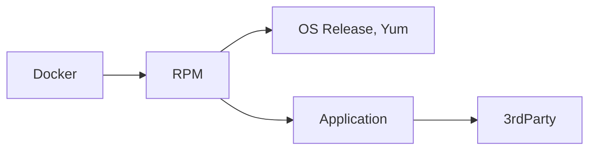

# But Why?

## Difficulties in toolchain maintenance

### Supporting shared toolchains is easy

...but complicated!

- You had to turn off a feature on one platform because a
  dependency was not supported or available for that platform.
- Platform is new and compiler chain requires bootstrapping.
- The time that developer needed a patch applied for their specific
  use case.
- Did you know developers were copying your toolchain libraries
  into product releases?
- The time a certain customer made a deal with your company to
  better prioritize quality on their difficult-to-work-with
  platform over other platforms.
- Commercial tool is only available in binary form, and installer
  only speaks "/usr/local".
- OS packaging needs to avoid conflict with OS vendor-provided packages,
  but wants the benefit of "just works" package installation picking up
  all required OS dependencies.

### The system has to outlast the original maintainer

- Existing configurations are not well documented, if at all.
- Existing build system is highly customized to for your specific
  prefix/repository.

### What's wrong with `$PATH`?

Relying on the environment provided is a great solution.. for containers.
In a container environment you are incentivized to install only the desired
tool versions that are appropriate for running the application or task.
Whichever tool your default `$PATH` locates for you should be the correct
choice.

On a VM or baremetal host, with tools installed in `/usr/local`, or
perhaps in an automounted NFS repositories, `$PATH` has to be set
carefully to find the right tool installations, and it's not set by
default.  Additionally, a user may still run a tool that isn't in their
`$PATH`, and what then?  If *that* tool relies on other tools (such as
`gcc` needing `as` and `ld` from binutils), how does it find the right
ones?  How can that user be confident it will work correctly and
reliably?

## Why Conan?

Conan is designed for building, installing, and packaging 3rdParty
software, especially Open Source software.

Conan doesn't completely satisfy our toolchain installation requirements
on it's own, but it gets us like 90% of the way there.  Check out these
features:

- Integrity Validation for original tool source, and derived package builds
- DESTDIR installation management built-in
- Built-in [custom deployer](https://docs.conan.io/2/reference/extensions/deployers.html)
  hook exactly where we need it in the process
- Integration with many [3rdParty build systems](https://docs.conan.io/2/integrations.html)
- [Conan Center](https://conan.io/center) - Extensive database of build
  recipes for thousands of Open Source tools

### Profiles

Do you need to build your tools for multiple platforms?  Conan profiles
help with that!  Swap in a different compiler, compiler version, or turn
on debugging symbols, code coverage, sanitizers, all without modifying
your software!

```none title="Sample Conan asan profile"
[settings]
arch=armv8
build_type=Release
compiler=gcc
compiler.cppstd=gnu17
compiler.libcxx=libstdc++11
compiler.version=11
os=Linux

[options]
*:install_prefix=/opt/toolchain

[buildenv]
LD_FLAGS="-fsanitize=address -static-libasan"

[runenv]
LD_PRELOAD=/opt/toolchain/lib64/libasan.so.8
```

### System Package Integration

Conan can speak Yum (RedHat), Apt (Debian), and more!  While this feature
is intended to provide a working build and runtime for native Conan
packages, we can leverage this metadata to connect our package builds to
OS-provided packages, not just other Conan packages.

!!! note annotate "Reference"

    - https://docs.conan.io/2/reference/tools/system/package_manager.html

## Why RPM?

### Ease of Use

When building custom container images with our Conan packages, we want
the installation process to be as straightforward as possible.
In an enterprise Engineering organization, we want each product to be
able to customize their sandbox or CI environment with minimal friction.

When we `yum install -y toolchain-gcc` in a fresh container, we want a
working `gcc` when it's done!  We don't want to have to add other system
dependencies that we happen to know that GCC requires.

As we want to support the Developer Sandbox with DevContainers, it's
important to make it as easy as possible for each developer to install
our preferred packages to ensure a reliable result.

!!! note annotate "Reference"

    - https://code.visualstudio.com/docs/devcontainers/containers

### SBoM / Software Composition Analysis

Dependency tracking tools like Black Duck and syft are able to scan
container images and record installed RedHat RPMs, Debia .deb, and
macOS .dmg out of the box.

In contrast, files that are simply copied into a container image are
difficult to determine the source for, and often result in incorrect
dependencies detected, creating a mess that needs to be manually sorted
out by DevOps or Release Mangagement.

Leveraging the system package manager creates a vital linkage in your
release provenance documentation.



!!! note annotate "Reference"

    - https://blackducksoftware.github.io/blackduck-docker-inspector/latest/advanced/
    - https://github.com/anchore/syft#supported-ecosystems

### Integrity Verification

- First, system packages can be signed, ensuring they are from trusted
  sources at install time.
- Second, after installation the installed contents can be verified as
  well.

!!! note annotate "Reference"

    - https://rpm-packaging-guide.github.io/#Signing-Packages
    - http://ftp.rpm.org/max-rpm/ch-rpm-verify.html

## Common Issues

### Avoiding package name conflicts

What if we want RedHat's system python installed as well as ours?

What if we want to support multiple toolchains in the same host or
container image?  Cross-compiling, product branching..

In this system, we name each package carefully to associate it with
the toolchain/prefix it supports.

```bash title="Multiple GCC versions installed without conflict"
$ rpm -q --whatprovides /usr/bin/gcc
gcc-11.5.0-5.el9_5.alma.1.aarch64
$

$ rpm -q --whatprovides /opt/toolchain/bin/gcc
opt_toolchain-gcc-15.1.0-1.el9.aarch64
$
```
