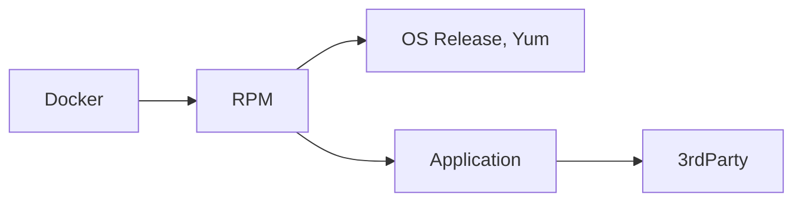

# But Why?

## Difficulties in toolchain maintenance

### Supporting shared toolchains is easy

...but complicated!

Perhaps you've experienced some of these scenarios:

- You've had to turn off a tool feature on one platform because a
  dependency was not supported or available for that platform.
- Platform is new and compiler chain requires bootstrapping.
- The time that developer needed a patch applied for their specific
  use case.
- Did you know that developers were copying libraries from your
  toolchain into product releases?  Let's support that and avoid
  duplication of effort!
- The time a certain customer made a deal with your company to
  better prioritize your product's quality on their difficult-to-work-with
  platform.  Over your developers' preferred platform.
- Commercial tool is only available in binary form, and installer
  only speaks "/usr/local".
- We want to avoid conflicts with OS vendor-provided packages, but also
  want the benefit of "just works" package installation picking up
  all required OS dependencies.
- You need to add support for a new OS distro/version/architecture,
  but need your toolchain on the new platform to behave consistently with
  your existing platform toolchains.

### The system has to outlast the original maintainer

- Existing tool build configurations are not well documented, if at all.
- Existing build system is highly customized to for your specific
  prefix/repository.

### What's wrong with `$PATH`?

Relying on the environment provided is a great solution.. for containers.
In a container environment you are incentivized to install only the desired
tool versions that are appropriate for running the application or task.
Whichever tool your default `$PATH` locates should be the correct choice.

On a VM or baremetal host, with tools installed in `/usr/local`, or
perhaps in an automounted NFS repositories, everything works differently.
`$PATH` has to be set carefully to find the right tool installations, and
it's not set by default.  Additionally, a user may still run a tool that
isn't in their `$PATH`, so what then?  If *that* tool relies on other
tools (such as `gcc` calling `as` and `ld` from binutils), how does it
find the right ones?  How can that user be confident it will work
correctly and reliably?

## Why is installation prefix important?

A great deal of software is written in relocatable form these days, but
there is still a long way to go.  Tools such as GCC need to be able to
locate it's own libraries, as well as tools like `as` and `ld` from a
different package (binutils).  Relying on `$PATH` or `$ORIGIN` may not
be sufficient to consistently and reliably locate the correct
dependency versions.

!!! note annotate "Reference"

    `$ORIGIN` can be notoriously difficult to work with.  Layered build
    systems can present a significant quoting challenge, so consider
    unconventional methods like `XORIGIN`.

    - [rpath=$ORIGIN not having desired effect?](https://stackoverflow.com/questions/6324131/rpath-origin-not-having-desired-effect#comment92683351_6324131)
    - [A description of RPATH $ORIGIN LD_LIBRARY_PATH and portable linux binaries](https://enchildfone.wordpress.com/2010/03/23/a-description-of-rpath-origin-ld_library_path-and-portable-linux-binaries/)

## Why Conan?

Conan is designed for building, installing, and packaging 3rdParty
software, especially open-source software.

Conan does not completely satisfy our toolchain installation requirements
on it's own, but it gets us about 90% of the way there.  Check out these
features:

- Integrity Validation for original tool source, and derived package builds
- DESTDIR installation management built-in
- Built-in [custom deployer](https://docs.conan.io/2/reference/extensions/deployers.html)
  hook exactly where we need it in the process
- Integration with many [3rdParty build systems](https://docs.conan.io/2/integrations.html)
- [Conan Center](https://conan.io/center) - Extensive database of build
  recipes for thousands of open-source tools

### Profiles

Do you need to build your tools for multiple platforms?  Conan profiles
help with that!  Swap in a different compiler, compiler version, or turn
on debugging symbols, code coverage, sanitizers, all without modifying
your software!

```none title="Sample Conan asan profile"
[settings]
arch=armv8
build_type=Release
compiler=gcc
compiler.cppstd=gnu17
compiler.libcxx=libstdc++11
compiler.version=11
os=Linux

[options]
*:install_prefix=/opt/toolchain

[buildenv]
LD_FLAGS="-fsanitize=address -static-libasan"

[runenv]
LD_PRELOAD=/opt/toolchain/lib64/libasan.so.8
```

### System Package Integration

Conan can speak Yum (RedHat), Apt (Debian), and more!  While this feature
is intended to provide a working build and runtime for native Conan
packages, we can leverage this metadata to connect our system package
builds to OS-provided packages, not just other Conan packages.

!!! note annotate "Reference"

    - https://docs.conan.io/2/reference/tools/system/package_manager.html

## Why System Packaging?

### Ease of Use

When building custom container images using our toolchain packages, we
want the installation process to be as straightforward as possible.
In an enterprise Engineering organization, we want each product team to be
able to customize their sandbox or CI environments with minimal friction.

When we `yum install -y opt-toolchain-gcc` in a fresh container, we want a
working `gcc` when it's done!  We don't want to have to remember to add
other system dependencies that we happen to know GCC depends on.

As we also want to support the Developer Sandbox with DevContainers, it is
critically important to make it as easy as possible for each developer to
install our preferred and trusted packages to ensure a reliable result.

When developers find working with the toolchain difficult or
unproductive, they are often entirely capable of implementing their
own.  When developers start rolling their own toolchains, the impact may
look like any of the following:

- Duplication of effort: building and deploying the tools/libraries
- Unreproducible builds, requiring "tribal knowledge" within their team
- "Works on my machine": tests failing in CI/production
- Undetected software supply chain vulnerabilities

!!! note annotate "Reference"

    - https://code.visualstudio.com/docs/devcontainers/containers

### SBoM / Software Composition Analysis

Dependency and vulnerability tracking tools like Black Duck, Dependency
Track, and Artifactory are able to scan container images and record
installed RedHat RPMs, Debian .deb, and macOS .dmg out of the box.

In contrast, files that are simply copied into a container image are
difficult to track back to their originating source. This results in
incorrect dependencies being detected, creating a mess that needs to be
manually sorted out by DevOps or Release Mangagement.

In one example, a product team included a particular open-source
JavaScript library in their product.  The file system scan by the SCA
tool found that library, but identified the component source for that
file as Firefox because Firefox also includes that library in their
database.  This caused all known Firefox CVEs to be associated with
that product.  Quality metrics were a mess, resulting in a quality
escalation.  It delayed the product release through no fault of the
product team.

Even worse, a false positive result could be hiding a vulnerability in
your product!  Black hats don't put their faith in your SBoM! OS
packaging significantly reduces both false positives and negatives.

Relying on file-system scan for your SBoM means *a lot* of manual
data correction within your SCA tool, sometimes on a file-by-file basis.
Leveraging the system package manager creates a vital linkage in your
release provenance documentation.  It ensures accurate results, and
saves time, especially in unplanned escalations.



!!! note annotate "Reference"

    - [Why Your SCA is Always Wrong - Endor Labs Blog](https://www.endorlabs.com/learn/why-are-all-sca-tools-wrong)
    - https://blackducksoftware.github.io/blackduck-docker-inspector/latest/advanced/
    - https://github.com/anchore/syft#supported-ecosystems

### Integrity Verification

- System packages can (and should be) be signed, ensuring they are from
  trusted sources at install time.
- After package installation, the installed content integrity can be
  verified to be intact and unchanged as well.

!!! note annotate "Reference"

    - https://rpm-packaging-guide.github.io/#Signing-Packages
    - http://ftp.rpm.org/max-rpm/ch-rpm-verify.html
    - https://www.debian.org/doc/manuals/securing-debian-manual/deb-pack-sign.en.html

## Common Issues

### Avoiding package name conflicts

What if we want RedHat's system python installed as well as our own?
IT needs their python version on every system for Ansible to work
reliably.  RedHat's own `yum` tool depends on python.. it's a very
likely scenario.

What if we want to support multiple toolchains in the same host or
container image?  Cross-compiling, product branching..

In this system, we name each package using a convention that associates
it with the toolchain/prefix it supports.

```bash title="Multiple GCC versions installed without conflict"
$ rpm -q --whatprovides /usr/bin/gcc
gcc-11.5.0-5.el9_5.alma.1.aarch64
$ /usr/bin/gcc -v
/usr/bin/gcc -v
Using built-in specs.
COLLECT_GCC=/usr/bin/gcc
COLLECT_LTO_WRAPPER=/usr/libexec/gcc/aarch64-redhat-linux/11/lto-wrapper
Target: aarch64-redhat-linux
Configured with: ../configure \
                   --enable-bootstrap \
                   --enable-host-pie \
                   --enable-host-bind-now \
                   --enable-languages=c,c++,fortran,lto \
                   --prefix=/usr \
                   --mandir=/usr/share/man \
                   --infodir=/usr/share/info \
                   --with-bugurl=http://bugs.almalinux.org/ \
                   --enable-shared \
                   --enable-threads=posix \
                   --enable-checking=release \
                   --with-system-zlib \
                   --enable-__cxa_atexit \
                   --disable-libunwind-exceptions \
                   --enable-gnu-unique-object \
                   --enable-linker-build-id \
                   --with-gcc-major-version-only \
                   --enable-plugin \
                   --enable-initfini-array \
                   --without-isl \
                   --enable-multilib \
                   --with-linker-hash-style=gnu \
                   --enable-gnu-indirect-function \
                   --build=aarch64-redhat-linux \
                   --with-build-config=bootstrap-lto \
                   --enable-link-serialization=1
Thread model: posix
Supported LTO compression algorithms: zlib zstd
gcc version 11.5.0 20240719 (Red Hat 11.5.0-5) (GCC) 
$

$ rpm -q --whatprovides /opt/toolchain/bin/gcc
opt-toolchain-gcc-15.1.0-1.el9.aarch64
$ /opt/toolchain/bin/gcc -v
/opt/toolchain/bin/gcc -v
Using built-in specs.
COLLECT_GCC=/opt/toolchain/bin/gcc
COLLECT_LTO_WRAPPER=/opt/toolchain/libexec/gcc/aarch64-unknown-linux-gnu/12.2.0/lto-wrapper
Target: aarch64-unknown-linux-gnu
Configured with: /__w/conan-github-workflows/conan-github-workflows/CONAN_HOME/p/b/gcce3fadc7d9cb2a/b/src/configure \
                   --prefix=/opt/toolchain \
                   --bindir='/opt/toolchain/bin' \
                   --sbindir='/opt/toolchain/bin' \
                   --libdir='/opt/toolchain/lib' \
                   --includedir='/opt/toolchain/include' \
                   --oldincludedir='/opt/toolchain/include' \
                   --with-as=/opt/toolchain/bin/as \
                   --with-ld=/opt/toolchain/bin/ld \
                   --enable-languages=c,c++,fortran \
                   --disable-nls \
                   --disable-multilib \
                   --disable-bootstrap \
                   --with-zlib=/__w/conan-github-workflows/conan-github-workflows/CONAN_HOME/p/b/zlibf65861dbd5700/p \
                   --with-isl=/__w/conan-github-workflows/conan-github-workflows/CONAN_HOME/p/b/isle7890ac49bf41/p \
                   --with-gmp=/__w/conan-github-workflows/conan-github-workflows/CONAN_HOME/p/b/gmp2a63bb32f5d6d/p 
                   --with-mpc=/__w/conan-github-workflows/conan-github-workflows/CONAN_HOME/p/b/mpc8a61687c8a20f/p 
                   --with-mpfr=/__w/conan-github-workflows/conan-github-workflows/CONAN_HOME/p/b/mpfr0ee7ef75967a2/p --with-pkgversion='conan GCC 12.2.0' \
                   --with-bugurl=https://github.com/conan-io/conan-center-index/issues
Thread model: posix
Supported LTO compression algorithms: zlib
gcc version 12.2.0 (conan GCC 12.2.0) 
$
```
