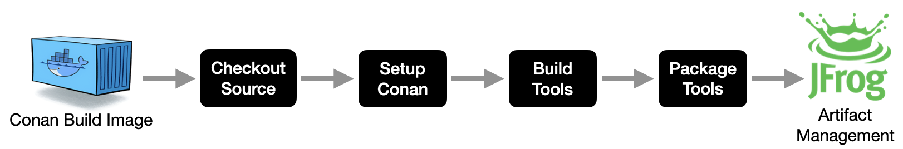

# CI Workflows

!!! github-reference annotate "[conan-github-workflows](https://github.com/DaverSomethingSomethingOrg/conan-github-workflows)"

    Custom [GitHub Actions Reusable Workflows](https://docs.github.com/en/actions/sharing-automations/reusing-workflows)
    to provide multi-platform build/test/release workflows for individual
    Conan builds, and for complete toolchain builds.

    - https://github.com/DaverSomethingSomethingOrg/conan-github-workflows

## Toolchain Workflow

!!! note annotate "Basic Conan Toolchain Workflow"

    

## Multi-Platform Toolchain Workflow

!!! note annotate "Multi-Platform Conan Toolchain Workflow"

    

## Basic Operation

### Triggering a Toolchain Build (demo)

!!! github-reference annotate "Conan Toolchain Workflow Dispatch"

    

!!! github-reference annotate "Conan Multi-Phase Multi-Platform Chart"

    

!!! github-reference annotate "Conan Workflow Steps"

    
