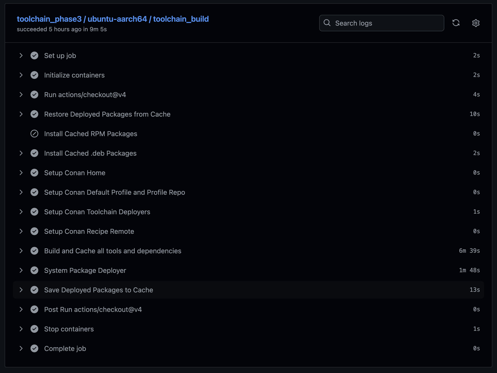

# CI Workflows

!!! github-reference annotate "[conan-github-workflows](https://github.com/DaverSomethingSomethingOrg/conan-github-workflows)"

    Custom [GitHub Actions Reusable Workflows](https://docs.github.com/en/actions/sharing-automations/reusing-workflows)
    to provide multi-platform build/test/release workflows for individual
    Conan builds, and for complete toolchain builds.

    - https://github.com/DaverSomethingSomethingOrg/conan-github-workflows

## Toolchain Workflow

!!! note annotate "Basic Conan Toolchain Workflow"

    

## Multi-Platform Toolchain Workflow

!!! note annotate "Multi-Platform Conan Toolchain Workflow"

    

## Demo Multi-Phase Build

We use our tools to build our tools.  But we need to get started
on a new platform by building our basic compiler suite.

Using caching in GitHub Actions, we can connect multiple toolchain
workflows to each other, so that dependencies built in one phase
can be installed during subsequent phases.

### Phase 1 - GNU binutils

GCC depends on binutils, so that's where we start.  We need a working
compiler to build our tools though, so we'll use a special bootstrap
container image with the OS Vendor's compiler chain installed.

```python title="phase 1 - conanfile.py"
    # For this bootstrapping phase we'll depend on OS vendor-provided compilers
    def system_requirements(self):
        Apt(self).install(["make", "cmake", "binutils", "gcc"])
        Yum(self).install(["make", "cmake", "binutils", "gcc"])

    def requirements(self):
        self.requires("binutils/2.42")
```

### Phase 2 - bootstrapping CMake, GNU Make, and GCC

```python title="phase 2 - conanfile.py"
    # For this bootstrapping phase we'll depend on OS vendor-provided compilers
    def system_requirements(self):
        Apt(self).install(["make", "cmake", "binutils", "gcc"])
        Yum(self).install(["make", "cmake", "binutils", "gcc"])

    def requirements(self):
        self.requires("make/4.4.1")
        self.requires("cmake/4.0.1")
        self.requires("gcc/12.2.0"
```

### Phase 3 - Clean rebuilds using our toolchain

Finally, we will go back to our OS-minimal container image, install the
tools we built in the previous phases, and rebuild all of our tools.

By using the OS-minimal image this time, we can be certain that there
will be no surprise dependencies at all on the OS-vendor toolchain.

We only upload these builds to Artifact Management, along with a brand
new Conan Build container image for building all other tools we support.
The previous packages built with our bootstrap image are discarded.

```python title="phase 3 - conanfile.py"
    def requirements(self):
        self.requires("make/4.4.1")
        self.requires("cmake/4.0.1")
        self.requires("binutils/2.42")
        self.requires("gcc/12.2.0"
```

!!! note annotate "For each platform, we end up with an overall flow that looks like this"

    

#### See Also

!!! github-reference annotate "[conan-docker-tools](https://github.com/conan-io/conan-docker-tools)"

    The Conan project builds similar images for this purpose, but with a
    few significant differences:

    - We use the same Conan recipes and mechanism (conan) to build our
      build container toolchain that we provide to developers.
    - We build both Ubuntu and AlmaLinux (RedHat compatible), as well as
      ARM and x86 CPU architectures. 
    

## Basic Operation

### Triggering a Toolchain Build (demo)

!!! github-reference annotate "Conan Toolchain Workflow Dispatch"

    

!!! github-reference annotate "Conan Multi-Platform Chart"

    

!!! github-reference annotate "Conan Workflow Steps"

    
