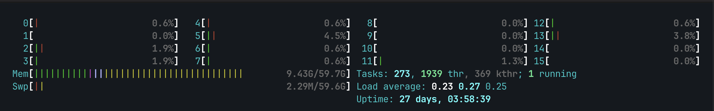
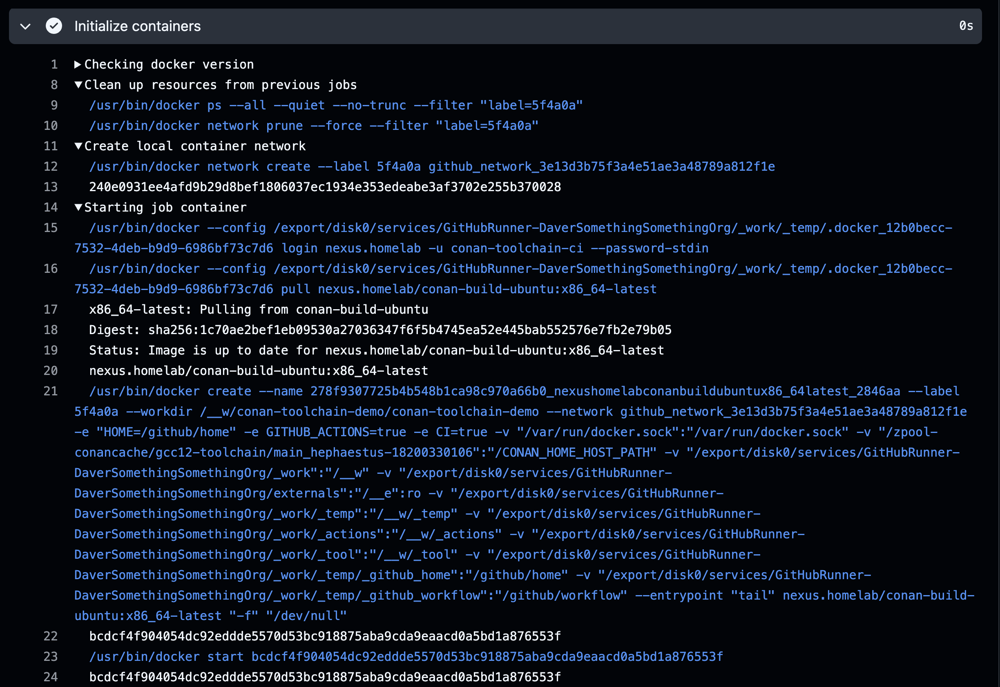
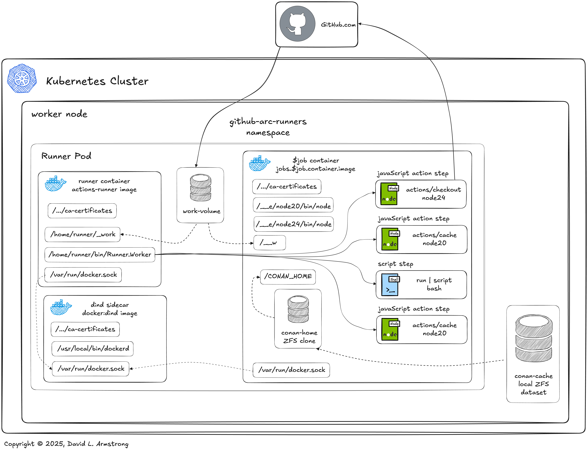
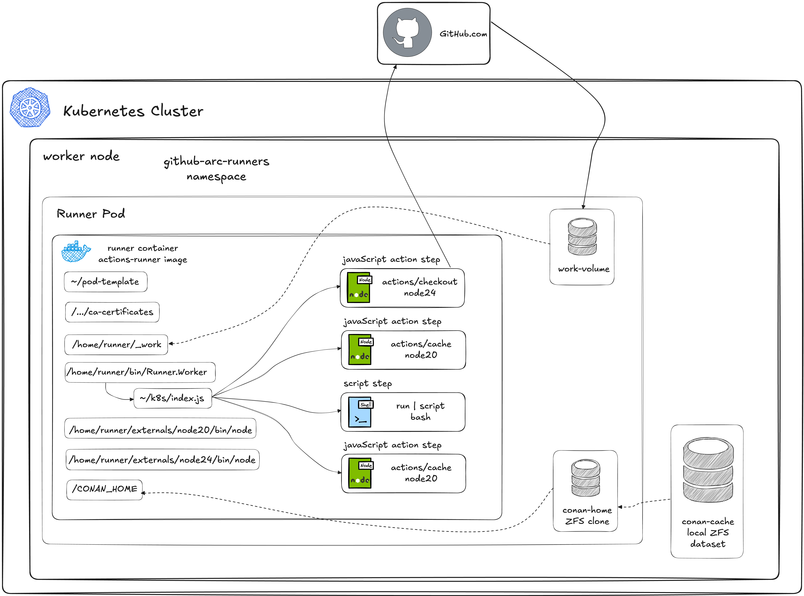

# Demo - Conan and ZFS and Kubernetes CI (Oh my!)

<!-- markdownlint-disable MD046 -->
<!-- markdownlint-disable MD034 -->

## Introduction

Continuing our work with [Conan Sandboxes with ZFS](ConanZFSDemo.md) and
[Conan DevContainers with ZFS in Kubernetes](ConanK8sDevContainerDemo.md),
this time we'll explore implementing a CI solution in our Kubernetes
environment using GitHub Actions Runner Controller (ARC) with OpenEBS.

We'll skip over most of the boilerplate and default setup and focus on
just the special configuration details required for leveraging our ZFS
Conan Cache with GitHub Actions in Kubernetes.

!!! quote annotate ""

    

    *Check out [Excalidraw](https://excalidraw.com/) and their nifty diagramming tool!*

## Environment

### Hardware

We'll be using the same hardware as we did in our previous demos.

- Server - AMD 8945HS/64GB/SSD
- Workstation - AMD 9900X/32GB/SSD
- Notebook - Macbook Pro M4 Pro
- Network - Ubiquiti UniFi 2.5Gb/s Switch

We've added a few new services onto our server, but at idle we're still
using only 10GB of RAM and just a fraction of a single CPU core.



Since we're making heavy use of build avoidance through caching, we're
able to use a power-efficient CPU and don't need a very elaborate storage
configuration.  We are running a significant number of processes however;
we'll want to have a flexible number of CPU cores and a good amount of
memory to avoid thrashing.

### Software

- [GitHub Actions Runner Controller (ARC)](https://github.com/actions/actions-runner-controller/blob/master/README.md)
- [OpenZFS](https://openzfs.org/) filesystem and storage platform
- [OpenEBS](https://openebs.io/) with [Local PV ZFS plugin](https://github.com/openebs/zfs-localpv/blob/develop/README.md)
- [Conan C/C++ Package Manager](https://conan.io/)
- Docker - [ConanToolchain Docker Container Image](https://github.com/DaverSomethingSomethingOrg/conan-toolchain-demo/tree/main/demos/gcc-toolchain/conan-build-container/README.md)
- [Sonatype Nexus Community Edition](https://www.sonatype.com/products/nexus-community-edition-download)

## OpenEBS ZFS Setup

We'll reuse the ZFS installation from our previous demo as well, including
the toplevel dataset we populated with a toolchain build to clone our
DevContainers from.

[Click here for more information](ConanK8sDevContainerDemo.md#openebs-zfs-setup)

!!! warning annotate

    OpenEBS does not support advanced ZFS operations such as `promote` or
    `rename`, so we'll need to look at a different approach to replace these
    parts of the workflow we used outside of Kubernetes.
    [Conan ZFS Demo Workflow](ConanZFSDemo.md#promote-the-successful-builds-clone)

## Comparing GitHub ARC Configurations

GitHub Actions Runner Controller is *complicated*, and documentation is
fairly sparse.  It ships with reasonable defaults that make ARC easy to
get deployed and working, but customizing its behavior requires a strong
understanding of ARC and GitHub Runners in general.  Some topics are
documented in far more detail than others, but the community appears to
be responsive to Issues and questions posted to their GitHub projects to
fill in the gaps.  I've included links in the [References](#references)
section for the most directly applicable documentation I found in setting
up this demo.

In order to work with our ZFS Conan cache using GitHub ARC Runners, we
first need to look at how GitHub Actions Runners behave when using GitHub
ARC.  Out of the box, GitHub ARC's
[RunnerScaleSet](https://github.com/actions/actions-runner-controller/blob/master/docs/gha-runner-scale-set-controller/README.md)
includes a
[`containerMode`](https://docs.github.com/en/actions/tutorials/use-actions-runner-controller/deploy-runner-scale-sets#using-docker-in-docker-or-kubernetes-mode-for-containers)
configuration option which probably affects its behavior more dramatically
than all other options.  On the workflow side, choosing to
[run in a container](https://docs.github.com/en/actions/how-tos/write-workflows/choose-where-workflows-run/run-jobs-in-a-container)
or not will affect the behavior of this solution the most.  We'll compare
different configurations of these two primary options in this demo.

### `containerMode: kubernetes` with containerized workflows

First we'll look at `containerMode: kubernetes` with containerized workflows.
This mode has the distinct advantage over all other modes of waiting until
the workflow job starts in order to snapshot and clone our ZFS Conan cache.
This ensures that the cache is as up-to-date as it can be, while keeping
warm standby Runner processes ready to take on new jobs.

!!! note annotate "`containerMode: kubernetes` with containerized workflows"

    

Optimizing performance is beyond the scope of this demo, but keeping
Runners on stand-by, ready to launch new jobs seems like a reasonable
step towards minimizing response time in starting jobs.

#### How it works

There's a lot going on here, but in a nutshell:

1. We set the `ACTIONS_RUNNER_CONTAINER_HOOKS` in the Runner container
   environment.  This will point to a wrapper script that the Runner will
   use to run our workflow actions and script steps rather than running
   then directly itself.  We'll use the hook package included in the
   default Runner image:
   [`/home/runner/k8s/index.js`](https://github.com/actions/runner-container-hooks/blob/main/packages/k8s/README.md)
1. `ACTIONS_RUNNER_CONTAINER_HOOK_TEMPLATE` points the `k8s/index.js`
   hook to our workflow pod spec "extension" to connect our ZFS cache PVC
   to the workflow `$job` container. We'll use a ConfigMap and volumeMount
   it for this piece of the puzzle.
1. At job start time, the `k8s/index.js` wrapper creates the workflow pod
   and starts the `$job` container.
1. As the `$job` container is started, our PVC volume specification causes
   OpenEBS to snapshot and clone our ZFS Conan cache DataSet. It'll be
   volumeMount'd just as we did with our devContainer.
1. `Runner.Worker` hands off each workflow job step to the
   `k8s/index.js` wrapper for execution in the `$job` container.
1. Upon job completion, the ZFS cache PVC, `$job` container, and the
   runner and workflow jobs are all destroyed and resources freed up.

For all of this complex functionality, the configuration involved is
remarkably minimal (details below).  Understanding how the Runner and hook
operate is critical to setting it up correctly and troubleshooting any
issues with your workflows in the future.

#### Issues with `containerMode: kubernetes`

This solution satisfies our functional requirements nicely, but still has
some rough spots and limitations we'll need to work around.

- `k8s/index.js` doesn't show its work

    When compared with `containerMode: dind`, or a shell runner operating
    a containerized workflow, `k8s/index.js` doesn't log much information
    unless an error is encountered. This is especially evident in the
    container orchestration done to prepare a job for running prior to
    starting it.

    For troubleshooting workflow issues at runtime, the GitHub Actions
    logs do not give us much information to work with.  This probably
    benefits our security posture by not exposing as many details about
    our infrastructure, but it also limits our diagnostic capability.

    To illustrate this issue, check out the screenshots below with the log
    output from running the same containerized workflow using shell and
    kubernetes runners (particularly the "Initialize containers" step):

    !!! note annotate "Example: Shell Runner "Initialize containers" workflow step"

        

    !!! note annotate "Example: ARC K8s Runner "Initialize containers" workflow step"

        

- `k8s/index.js` is slow!

    From those same screenshots above we can see a significant difference
    in the time taken by `k8s/index.js` vs orchestrating docker.  Without
    more logging and timing data it's difficult to understand where this
    additional time is spent, but we'll look into that in the future.

- The `k8s/index.js` hook extension is limited to the Workflow Pod
  definition only

    The hook extention template is only able to modify or extend the
    Workflow Pod template; it is not capable of orchestrating resources
    outside of provisioning the Workflow Pod.  While this is already a
    plus over the other configurations discussed below, it is still an
    inconvenient limitation for our use case.

    Since we cannot create a PersistentVolume within a Pod defintion,
    we can only leverage the automatic snapshot PV provisioning OpenEBS
    provides when creating a clone PVC.  This results in sub-optimal
    names for each of our snapshots, not directly associated with our
    clones.  If we were able to provision our snapshot PVs directly, we
    would be able to give them better names to match our clone PVCs.

!!! warning annotate

    Take particular note of the other limitations listed in the
    `k8s/index.js`
    [documentation](https://github.com/actions/runner-container-hooks/blob/main/packages/k8s/README.md#limitations).
    The limitations listed there did not restrict any functionality of our
    demo, but YMMV (Your Mileage May Vary) with your own workflows.

### `containerMode: dind` with containerized workflows

`containerMode: dind` behaves similarly to `containerMode: kubernetes`
overall, but using a dind sidecar container to orchestrate the workflow
`$job` container using Docker rather than calling the Kubernetes API.

!!! note annotate "`containerMode: dind`"

    

#### Issues with `containerMode: dind`

- Docker-in-Docker offers no Kubernetes/OpenEBS integration

    Without a means to work with the Kubernetes API, we cannot leverage
    OpenEBS to provision snapshot PVs or clone PVCs when starting the
    `$job` container for the workflow.

    We do have access to the Runner container spec, so we can provision
    a snapshot/clone at Runner start time.  Making this clone PVC available
    to the workflow `$job` container is awkward at best, however.

- Docker-in-Docker security options are more limited.

    When using Docker-in-Docker, the workflow `$job` container is running
    in the same pod as the Runner container.  This means they share the
    same network and IPC namespace, potentially exposing your Runner
    infrastructure to security vulnerabilities introduced by the workflow
    and it's specified container image.

### Non-Containerized Workflows

Non-containerized workflows generally work very similarly with either
`containerMode`.  No workflow `$job` container will be created, and
workflows will run directly in the Runner container.  In effect they are
very similar to using the Runner container as a dynamically scaled shell
runner.

!!! note annotate "`Non-Containerized Workflows`"

    

#### Issues with Non-containerized Workflows

Non-Containerized Workflows with GitHub ARC are sub-optimal for a variety
of reasons.

- Customizing the container

    Customizing the Runner container requires redeploying the
    RunnerScaleSet with an updated container image, or making the
    modifications at workflow runtime.  In order to modify the Runner
    container image, the Runner software needs to be installed, along
    with any dependencies for actions or the workflows.

    !!! warning annotate

        "Any updates released for the software, including major, minor, or
        patch releases, are considered as an available update. If you do
        not perform a software update within 30 days, the GitHub Actions
        service will not queue jobs to your runner. In addition, if a
        critical security update is required, the GitHub Actions service
        will not queue jobs to your runner until it has been updated."

        *[GitHub Actions Reference - Self-hosted runners](https://docs.github.com/en/actions/reference/runners/self-hosted-runners#runner-software-updates-on-self-hosted-runners)*

- OpenEBS ZFS snapshot and clone are provisioned at Runner start time

    Similar to `containerMode: dind` with containerized workflows we are
    able to mount our OpenEBS ZFS Conan cache PVC to the Runner container,
    but this is done at Runner start time, not job start time.  The
    snapshot will be as old as the Runner has been idle prior to recieving
    a job to run.

    For a highly utilized RunnerScaleSet, this is probably not a big deal.
    If you have RunnerScaleSets assigned to quieter branches however, you
    may want to minimize the number of standby Runners to ensure the Conan
    cache clone is up-to-date.  This will delay job startup however.

- Security is minimal

    Your workflows are running with the same privilege and access as your
    Runner processes.  While Kubernetes generally provides a higher level
    of security in general to shell runners, this is still not
    recommended.

***For best results with our ZFS Conan cache it is recommended to fully
disable support for non-containerized workflows.***

## Configuring GitHub ARC

For this demo we'll be using the `containerMode: kubernetes` with
containerized workflows configuration.  Having the Conan Cache snapshot
taken as late as possible (when the job starts) ensures that it is
current with the latest component builds available.

A second significant benefit to this approach is the ability to extend
the workflow pod configuration without having to redeploy or "upgrade"
our RunnerScaleSets, or even restart the runners.

### RunnerScaleSet Helm Chart values.yaml

First, we configure our RunnerScaleSet to run in `kubernetes` containerMode
and to look for our `github-arc-container-hooks` Hook Extension.  Click on
the embedded annotations in the snippet below for more information.

!!! note annotate "GitHub ARC kubernetes containerMode configured for Hook Extension Template"

    ```yaml
    containerMode:
      type: "kubernetes" # (1)!

    template:
      spec:
        containers:
        - name: runner
          image: ghcr.io/actions/actions-runner:latest # (2)!
          command: ["/home/runner/run.sh"]
          env:
            - name: ACTIONS_RUNNER_CONTAINER_HOOKS # (3)!
              value: /home/runner/k8s/index.js
            - name: ACTIONS_RUNNER_CONTAINER_HOOK_TEMPLATE # (4)!
              value: /home/runner/pod-template/content
            - name: ACTIONS_RUNNER_REQUIRE_JOB_CONTAINER # (5)!
              value: "true"
          volumeMounts:
            - name: work
              mountPath: /home/runner/_work
            - name: container-hooks-volume # (6)!
              mountPath: /home/runner/pod-template
        volumes:
        - name: work
          ephemeral:
            volumeClaimTemplate:
              spec:
                accessModes: [ "ReadWriteOnce" ]
                storageClassName: "local-path"
                resources:
                  requests:
                    storage: 1Gi
        - name: container-hooks-volume # (7)!
          configMap:
            name: github-arc-container-hooks
    ```

    1. Enable `containerMode: kubernetes`!

    1. We're using the default Runner container image maintained by GitHub

    1. Location where the k8s/index.js hook is installed in the Runner
       container image

    1. Location where our hook extension template will be mounted

    1. If a job doesn't specify a container, exit with an Error:
        

    1. Mount our hook extension volume where
       `ACTIONS_RUNNER_CONTAINER_HOOK_TEMPLATE` can locate it

    1. Set up the volume attached to our hook extension ConfigMap

    *[full source in GitHub](https://github.com/DaverSomethingSomethingOrg/conan-toolchain-demo/blob/main/demos/ZFS-clone/GitHub-ARC/clusters/values.yaml)*

### Attach `$CONAN_HOME` PersistentVolumeClaim using Hook Extension

Next, we'll define our `$CONAN_HOME` PersistentVolumeClaim in a ConfigMap
within the same namespace as the RunnerScaleSet.

This is done using the `ACTIONS_RUNNER_CONTAINER_HOOK_TEMPLATE` hook
extension functionality of the `k8s/index.js` hook.  See:
[*GitHub ARC Documentation* - Configuring hook extensions](https://docs.github.com/en/actions/tutorials/use-actions-runner-controller/deploy-runner-scale-sets#configuring-hook-extensions)
for more details.  This hook "extension" is specifcally intended to
provide for customization of the `$job` workflow container Pod.

Reference: [Mounted ConfigMaps are updated automatically](https://kubernetes.io/docs/tasks/configure-pod-container/configure-pod-configmap/#mounted-configmaps-are-updated-automatically)

!!! note annotate "GitHub ARC Hook Extension ConfigMap"

    ```yaml
    apiVersion: v1
    kind: ConfigMap
    metadata:
      name: github-arc-container-hooks # (1)!
    data:
      content: \| # (2)!
        metadata:
          annotations:
            example: "extension"
            annotated-by: "extension"
          labels:
            labeled-by: "extension"
        spec:
          containers:
            - name: $job
              volumeMounts:
                - name: conan-home
                  mountPath: /CONAN_HOME
              env:
                - name: CONAN_HOME # (3)!
                  value: /CONAN_HOME
          volumes:
            - name: conan-home
              ephemeral:
                volumeClaimTemplate:
                  spec:
                    accessModes: [ "ReadWriteOnce" ]
                    storageClassName: "openebs-zfspv"
                    dataSource:
                      name: gcc12-toolchain-main # (4)!
                      kind: PersistentVolumeClaim
                    resources:
                      requests:
                        storage: 200Gi # (5)!
    ```

    1. The name we use to identify the `container-hooks-volume` in our
       RunnerScaleSet `values.yaml` above

    1. The file will be named `content` and needs to match
       `ACTIONS_RUNNER_CONTAINER_HOOK_TEMPLATE` in our RunnerScaleSet
       `values.yaml` above.  It is technically yaml, but it's not part
       of this ConfigMap manifest, it's copied into a separate mainfest.

        !!! danger annotate

            *We escape the `|` here with `\` to allow mkdocs to annotate the yaml below, it must not be escaped in the actual ConfigMap!*

    1. Let Conan know where we mount our OpenEBS ZFS Conan cache volume

    1. The name of our parent OpenEBS ZFS PersistentVolumeClaim to snapshot
       and clone from

    1. Make sure this matches the storage requested by the parent PVC!

    *[full source in GitHub](https://github.com/DaverSomethingSomethingOrg/conan-toolchain-demo/blob/main/demos/ZFS-clone/GitHub-ARC/hookExtensionConfigMap.yaml)*

## GitHub Actions Workflow

For this demo I've implemented a simple GitHub Actions Workflow
[ConanZFSDemo-ARC.yml](https://github.com/DaverSomethingSomethingOrg/conan-toolchain-demo/blob/main/.github/workflows/ConanZFSDemo-ARC.yml).

Since all of the ZFS work is done by the Runner on job setup, we only need
to configure the `conan-toolchain.yml` workflow to locate our Conan Cache
PVC in `/CONAN_HOME`.

```yaml title="Configuring the conan-toolchain workflow to use our /CONAN_HOME PersistentVolumeClaim"
jobs:
  conan_toolchain:
    uses: DaverSomethingSomethingOrg/conan-github-workflows/.github/workflows/conan-toolchain.yml@main
    with:
      conan_home: "/CONAN_HOME" # (1)!
      [...]
```

1. Our reusable workflow defines its own default `$CONAN_HOME` environment
   variable for reliability, so we need to specify where our Runners mount
   our cache clone. *(otherwise we could trust `$CONAN_HOME` provided by
   the workflow `$job` container environment)*

## Limitations and Open Issues

### The PVC and ZFS clone are removed at job completion

When the runner pod is destroyed, our cache clone PVC and underlying ZFS
snapshot and clone are all destroyed, regardless of build success or
failure.

- https://kubernetes.io/docs/reference/generated/kubernetes-api/v1.23/#ephemeralvolumesource-v1-core

If we wish to retain the build or any cache modifications made during the
worfklow, we'll need to add additional workflow steps to save them outside
of the Runner prior to job completion.

With this mechanism, failed builds cannot be saved through the cache clone
directly.

### The PVC is provisioned against a static clone

Since we specify the clone parent in the Hook Extension ConfigMap, this
clone is not updated dynamically like we do in our non-Kubernetes workflow
using `zfs promote`.

If our RunnerScaleSet is deployed to the Organization rather than a single
repo, then all workflows accessing the RunnerScaleSet will share the same
cache.  In order to accommodate distinct parent clones, independent
RunnerScaleSets will need to be deployed.

This is good for efficiency and performance, but requires coordination to
update the original parent clone.

Modifying the hook extension ConfigMap is a mechanism we could use to
replace the `zfs promote` operation in our workflow.  We can simply swap
out the PVC parent clone `dataSource` the runner pod will snapshot from at
job startup time.

## Conclusions

GitHub ARC with OpenEBS for our ZFS Conan Cache is a highly scalable and
flexible system providing strong integration from the infrastructure to
the workflow.

There are a couple drawbacks however:

- While it's fairly simple to maintain, it is complicated to set up.

- While our CI snapshots and clones are neatly provisioned and cleaned up,
  we don't get the benefit of `zfs promote`, `zfs rename`, or other more
  complicated ZFS operations.  This requires additional management
  automation working behind the scenes.

## What's Next

By this point our solution is pretty complete!  We've shown the direct
build performance improvement delivered by our ZFS Conan Cache.  We've
also shown how to provide this benefit to Developers with Kubernetes-hosted
devContainers, and we've tied it into CI with GitHub ARC as well.

For next steps we need to start looking at bringing this solution to
production.  We need to dig in on end-to-end performance and security.
We'll also start attacking ease-of-use for both adminstrators and users.

### Performance Optimization

While this solution demonstrates our ability to leverage ZFS for maximum
Conan build performance/avoidance, there are still a few steps we can take
to optimize GitHub ARC and Runner performance, especially in job startup
time.

### Security Concerns

There are many security implications and configuration options with this
solution along with the performance concerns.  While GitHub ARC ships with
reasonable defaults for many environments, we'll need to explore and
refine the configuration for our own environment and needs prior to
promoting this solution for production use.

### Cache Promotion

When we build updated components in our cloned cache, we're not able to
promote the updated clone to parent for future builds to leverage.

The ConfigMap we're using to identify the parent dataset to clone from can
certainly help us here, but we need to be careful to avoid race conditions
when doing so.  We don't want a clone being pulled from a cache that's in
the process of being updated!

### Saving Broken Builds for Troubleshooting

With this setup we have the advantage of having an entire Pod setup we
can use to reproduce issues.  Not only do we have the cache clone
available, we also have the container used for the build.

By default these Runner and Workflow Pods are not persisted after job
completion.  We'll want to work out a mechanism that allows those Pods to
persist after job completion, but also be careful not to leave too many
Runner Pods laying around using up our cluster resources, even if they are
idle.

## References

- [*GitHub ARC Documentation* - About ARC](https://github.com/actions/actions-runner-controller/blob/master/docs/about-arc.md)
- [*GitHub ARC Documentation* - Autoscaling Runner Scale Sets mode](https://github.com/actions/actions-runner-controller/blob/master/docs/gha-runner-scale-set-controller/README.md)
- [*GitHub ARC Documentation* - K8s Hooks](https://github.com/actions/runner-container-hooks/blob/main/packages/k8s/README.md)
- [*GitHub ARC Documentation* - Using Kubernetes mode](https://docs.github.com/en/actions/tutorials/use-actions-runner-controller/deploy-runner-scale-sets#using-kubernetes-mode)
- [*GitHub ARC Documentation* - Configuring hook extensions](https://docs.github.com/en/actions/tutorials/use-actions-runner-controller/deploy-runner-scale-sets#configuring-hook-extensions)
