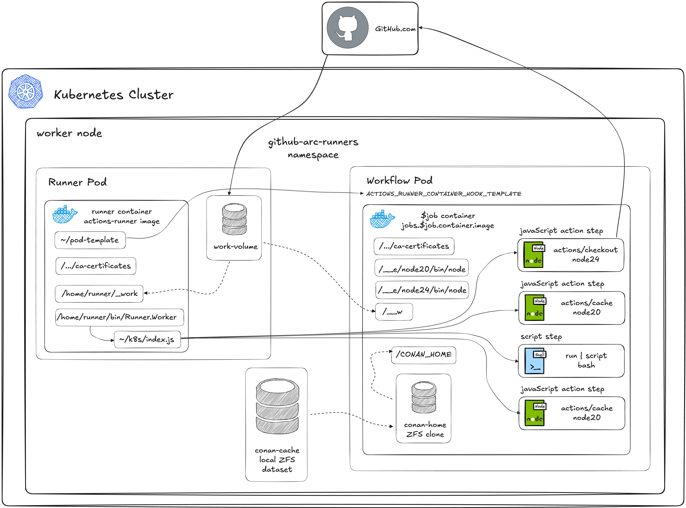

# Demo - Securing and Performing our GitHub ARC deployment

<!-- markdownlint-disable MD046 -->
<!-- markdownlint-disable MD034 -->

## Introduction

Continuing our work with [GitHub ARC with ZFS and Conan](ConanK8sARCDemo.md).

This time we'll explore optimizing the Performance and Security of our GitHub
ARC deployment, not that our product build is optimized.

!!! quote annotate ""

    

    *Check out [Excalidraw](https://excalidraw.com/) and their nifty diagramming tool!*

## Environment

### Hardware

We'll be using the same hardware as our previous demos.  All performance
optimizations in this demo are done in the configuration, we're not doing
any hardware optimization.

- Server - AMD 8945HS/64GB/SSD
- Workstation - AMD 9900X/32GB/SSD
- Notebook - Macbook Pro M4 Pro
- Network - Ubiquiti UniFi 2.5Gb/s Switch

### Software

- [GitHub Actions Runner Controller (ARC)](https://github.com/actions/actions-runner-controller/blob/master/README.md)
- [OpenZFS](https://openzfs.org/) filesystem and storage platform
- [OpenEBS](https://openebs.io/) with [Local PV ZFS plugin](https://github.com/openebs/zfs-localpv/blob/develop/README.md)
- [Conan C/C++ Package Manager](https://conan.io/)
- Docker - [ConanToolchain Docker Container Image](https://github.com/DaverSomethingSomethingOrg/conan-toolchain-demo/tree/main/demos/gcc-toolchain/conan-build-container/README.md)
- [Sonatype Nexus Community Edition](https://www.sonatype.com/products/nexus-community-edition-download)

## Security

- Running as non-privileged user
- Runner container and job container need to have compatible securityContexts.
- Runner container runs actions (including containerized Actions), so
  Runner container generally needs to ensure that all actions containers
  and job containers run as the same UID.
- It doesn't work when the actions/checkout container clones the repo as
  root but the workflow/build container runs non-privileged internally.
- non-privileged workflow pods
- locking container versions away from latest
- minimal container images
    - minimal runner
    - minimal workflow
- no sudo in workflow
- custom crafted workflow containers not modifyable by workflow
- namespace vs. cluster isolation
- dind-rootless
- Links to GitHub ARC documentation on security best practices

## Performance

- Runner container image caching for startup
- Workflow job container optimization
  - actions caching
  - node externals

## Limitations and Open Issues

## Conclusions

## What's Next

## References

- https://some-natalie.dev/blog/securing-ghactions-with-arc/