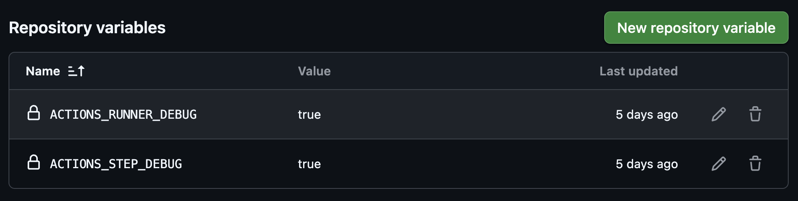
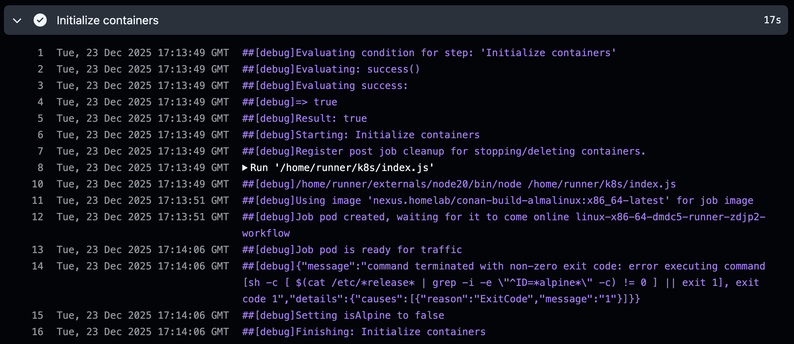

# Troubleshooting Conan ZFS GitHub ARC Container Initialization slowness

<!-- markdownlint-disable MD046 -->
<!-- markdownlint-disable MD034 -->

## Introduction

Continuing our work with [GitHub ARC with ZFS and Conan](ConanK8sARCDemo.md).

I've laid out here the step-by-step process I followed for troubleshooting an
issue I'm seeing in our GitHub Actions Runner Controller (ARC) deployment
along with OpenEBS and OpenZFS in order to optimize our CI and Developer
Sandbox build performance.  I've left out some of the trial & error tedium,
but not all of the misdirection and bad guesses as they were part of the fun.

!!! note annotate "GitHub ARC with ZFS and Conan"

    

    *Check out [Excalidraw](https://excalidraw.com/) and their nifty diagramming tool!*

When we left off, we were seeing that our GitHub ARC workflows were taking a
significant amount of time to start when using `containerMode: kubernetes` as
opposed to `containerMode: dind`.  We'll start with troubleshooting that issue
here.

!!! note annotate "Example: ARC K8s Runner "Initialize containers" workflow step"

    

This step normally takes no more than 1-3seconds, but is taking 30+ seconds
in our environment.  In this small-scale example, that delay even takes
more time than our ZFS caching solution saves us compared to downloading
our build dependencies from artifact management.

Since we did not experience anything odd or unexpected related to performance
in our [devContainer](ConanK8sDevContainerDemo.md) demo, this new
development is concerning.  This issue is crtical to resolve for the success
of this project!

### Environment

#### Hardware

We'll be using the same hardware as our previous demos.  All performance
optimizations in this demo are done in the configuration, we're not doing
any hardware optimization.

- Server - AMD 8945HS/64GB/SSD
- Workstation - AMD 9900X/32GB/SSD
- Notebook - Macbook Pro M4 Pro
- Network - Ubiquiti UniFi 2.5Gb/s Switch

#### Software

- [GitHub Actions Runner Controller (ARC)](https://github.com/actions/actions-runner-controller/blob/master/README.md)
- [OpenZFS](https://openzfs.org/) filesystem and storage platform
- [OpenEBS](https://openebs.io/) with [Local PV ZFS plugin](https://github.com/openebs/zfs-localpv/blob/develop/README.md)
- [Conan C/C++ Package Manager](https://conan.io/)
- Docker - [ConanToolchain Docker Container Image](https://github.com/DaverSomethingSomethingOrg/conan-toolchain-demo/tree/main/demos/gcc-toolchain/conan-build-container/README.md)
- [Sonatype Nexus Community Edition](https://www.sonatype.com/products/nexus-community-edition-download)

## GitHub ARC built-in debugging

We'll start by enabling the maximum logging GitHub Actions can provide.
We'll add two new variable definitions to the repo for GitHub Actions to use.

- https://docs.github.com/en/actions/how-tos/monitor-workflows/enable-debug-logging

| Variable | Value |
| -------- | ----- |
| `ACTIONS_RUNNER_DEBUG` | "true" (string) |
| `ACTIONS_STEP_DEBUG` | "true" (string) |



## Breaking it down

While GitHub doesn't provide granular timing data in its log files, we can
see precise timestamps for each log entry by pressing `Shift + T` while on
the job log screen.



Breaking this down, we can see where the majority of the time is going:

```text linenums="12"
Tue, 23 Dec 2025 17:13:51 GMT ##[debug]Job pod created, waiting for it to come online linux-x86-64-dmdc5-runner-zdjp2-workflow
Tue, 23 Dec 2025 17:14:06 GMT ##[debug]Job pod is ready for traffic
```

For this particular job, 15s of the total 17s of the "Initialize
containers" step is spent waiting for the created Pod to start running.

!!! github-reference annotate "[actions/runner-container-hooks/packages/k8s/src/hooks/prepare-job.ts](https://github.com/actions/runner-container-hooks/blob/v0.7.0/packages/k8s/src/hooks/prepare-job.ts#L90)"

    ```typescript linenums="90" hl_lines="2 17"
      core.debug(
        `Job pod created, waiting for it to come online ${createdPod?.metadata?.name}`
      )

      try {
        await waitForPodPhases(
          createdPod.metadata.name,
          new Set([PodPhase.RUNNING]),
          new Set([PodPhase.PENDING]),
          getPrepareJobTimeoutSeconds()
        )
      } catch (err) {
        await prunePods()
        throw new Error(`pod failed to come online with error: ${err}`)
      }

      core.debug('Job pod is ready for traffic')
    ```

## `waitForPodPhases()`

While `waitForPodPhases()` is not going to be the source of our slowness,
it's not providing much insight into what's happening either.

Let's take a look at what it does.

!!! github-reference annotate "[actions/runner-container-hooks/packages/k8s/src/k8s/index.ts](https://github.com/actions/runner-container-hooks/blob/v0.7.0/packages/k8s/src/k8s/index.ts#L371)"

    ```typescript linenums="371" hl_lines="5 7"
    export async function waitForPodPhases(
      podName: string,
      awaitingPhases: Set<PodPhase>,
      backOffPhases: Set<PodPhase>,
      maxTimeSeconds = DEFAULT_WAIT_FOR_POD_TIME_SECONDS
    ): Promise<void> {
      const backOffManager = new BackOffManager(maxTimeSeconds)
      let phase: PodPhase = PodPhase.UNKNOWN
      try {
        while (true) {
          phase = await getPodPhase(podName)
          if (awaitingPhases.has(phase)) {
            return
          }

          if (!backOffPhases.has(phase)) {
             throw new Error(
               `Pod ${podName} is unhealthy with phase status ${phase}`
             )
           }
           await backOffManager.backOff()
         }
       } catch (error) {
         throw new Error(`Pod ${podName} is unhealthy with phase status ${phase}`)
       }
     }
    ```

    ```typescript linenums="581" hl_lines="2 19 22"
    class BackOffManager {
      private backOffSeconds = 1
      totalTime = 0
      constructor(private throwAfterSeconds?: number) {
        if (!throwAfterSeconds || throwAfterSeconds < 0) {
          this.throwAfterSeconds = undefined
        }
      }

      async backOff(): Promise<void> {
        await new Promise(resolve =>
          setTimeout(resolve, this.backOffSeconds * 1000)
        )
        this.totalTime += this.backOffSeconds
        if (this.throwAfterSeconds && this.throwAfterSeconds < this.totalTime) {
          throw new Error('backoff timeout')
        }
        if (this.backOffSeconds < 20) {
          this.backOffSeconds *= 2
        }
        if (this.backOffSeconds > 20) {
          this.backOffSeconds = 20
        }
      }
    }
    ```

`waitForPodPhases()` uses a typical binary exponential backoff to poll
kubernetes for our workflow container to Running or Pending state.  This
is not ideal but it does have a max delay interval and a maxmium wait
time, so we're not going to worry about it.

### Conclusion

`waitForPodPhases()` is not the source of our delay, but the exponential
backoff may be making the problem appear worse than it is.  We are still
15s slower than Docker doing the equivalent work.  For some reason
Kubernetes is delaying our pod startup with ARC but not with our
DevContainer.

We need to go look at the Kubernetes logs for our next clues.

## Kubernetes Pod startup troubleshooting

Now that we're focused specifically on Kubernetes, we can directly compare
our DevContainer pod startup to our GitHub ARC Workflow pod startup.

The first step we'll take is to start one of each of our workflow and
devContainer pods, watching the timing on our devContainer to verify
that our startup delay doesn't occur.

We'll use the following manifest to test our devContainer pod startup.
We've changed it a bit since our devContainer demo to use the same
volume syntax as our GitHub ARC hook extension.  Previously we created
the `conan-home` PersistentVolumeClaim separately from the pod and then
mounted it.  We'll switch to including the `conan-home` PVC as an ephemeral
volume defined using a volumeClaimTemplate.  We're not expecting this to
be the cause of our startup delay, but we do want to elimintate it as a
variable before going further.

??? example annotate "DevContainer Pod manifest with `conan-home` PVC"

    ```yaml linenums="0"
    apiVersion: v1
    kind: Pod
    metadata:
      name: devcontainer-pod-test
      namespace: devcontainer
      labels:
        app: conan
        cache: gcc12-toolchain-main
    spec:
      initContainers:
      - name: code-init
        image: "nexus.homelab/conan-docker-build-ubuntu:x86_64-latest"
        securityContext:
          runAsUser: 0
          runAsGroup: 0
        command: ["/bin/sh", "-c", "git clone https://github.com/DaverSomethingSomethingOrg/conan-toolchain-demo.git /workspace/conan-toolchain-demo"]
        volumeMounts:
        - mountPath: /workspace
          name: code-volume

      containers:
      - name: conan-container
        image: "nexus.homelab/conan-docker-build-ubuntu:x86_64-latest"
        imagePullPolicy: IfNotPresent
        securityContext:
          runAsUser: 0
          runAsGroup: 0
        env:
        - name: CS_DISABLE_FILE_DOWNLOADS
          value: "1"
        - name: CONAN_HOME
          value: /CONAN_HOME
        workingDir: /workspace/conan-toolchain-demo
        command: ["/bin/sh", "-c", "while sleep 1000; do :; done"]
        volumeMounts:
        - mountPath: /workspace
          name: code-volume
        - mountPath: /home/vscode/.cache
          name: cache-volume
        - mountPath: /CONAN_HOME
          name: conan-home

      volumes:
      - name: code-volume
        emptyDir: {}
      - name: cache-volume
        emptyDir: {}
      - name: conan-home
        ephemeral:
          volumeClaimTemplate:
            spec:
              accessModes: [ "ReadWriteOncePod" ]
              storageClassName: "openebs-zfspv"
              dataSource:
                name: gcc12-toolchain-main
                kind: PersistentVolumeClaim
              resources:
                requests:
                 storage: 200Gi
              volumeMode: Filesystem
    ```

We'll use a simple bash script to time the pod startup until the pod
reaches "Running" status.

??? example annotate "timeStartup.sh source"

    ```bash linenums="0"
    #!/bin/bash

    FILENAME=$1

    SCRIPTNAME=$(basename $0)

    if [ -z "${FILENAME}" ]; then
        #echo "Usage: ${SCRIPTNAME} <file name> <pod name> <namespace>" 1>&2
        echo "Usage: ${SCRIPTNAME} <file name>" 1>&2
        exit 1
    fi

    if [ ! -f "${FILENAME}" ]; then
        echo "File not found: ${FILENAME}" 1>&2
        exit 1
    fi

    PODNAME=$(yq --raw-output ".metadata.name" "${FILENAME}" | head -1)
    NAMESPACE=$(yq --raw-output ".metadata.namespace" "${FILENAME}" | head -1)

    timingLoop(){
        kubectl apply -f "${FILENAME}" -n "${NAMESPACE}"

        while [ 0 ]; do

            STATUS=$(kubectl get pod -n "${NAMESPACE}" -o template "${PODNAME}" --template={{.status.phase}})
            echo -n "[${SECONDS}s] Status: ${STATUS}."

            if [ "${STATUS}" = "Running" ]; then
                break
            fi

            sleep 1
            echo "  Looping..."
        done
    }

    SECONDS=0
    time timingLoop
    ```

```bash linenums="0"
❯ ./timeStartup.sh devcontainer-pod-test.yaml
pod/devcontainer-pod-test created
[0s] Status: Pending.  Looping...
[1s] Status: Pending.  Looping...
[2s] Status: Pending.  Looping...
[3s] Status: Pending.  Looping...
[4s] Status: Running.
real    0m4.417s
user    0m0.473s
sys     0m0.208s

dave@hephaestus ~/projects/K3sDevContainer/devContainer                                                                                                         09:38:34
❯
```

```bash linenums="0" title="DevContainer Pod Events"
❯ kubectl describe pod devcontainer-pod-test -n devcontainer
[...]
Events:
  Type     Reason            Age                    From               Message
  ----     ------            ----                   ----               -------
  Warning  FailedScheduling  2m19s                  default-scheduler  0/1 nodes are available: waiting for ephemeral volume controller to create the persistentvolumeclaim "devcontainer-pod-test-conan-home". preemption: 0/1 nodes are available: 1 Preemption is not helpful for scheduling.
  Warning  FailedScheduling  2m19s (x2 over 2m19s)  default-scheduler  0/1 nodes are available: pod has unbound immediate PersistentVolumeClaims. preemption: 0/1 nodes are available: 1 Preemption is not helpful for scheduling.
  Warning  FailedScheduling  2m18s (x2 over 2m18s)  default-scheduler  0/1 nodes are available: pod has unbound immediate PersistentVolumeClaims. preemption: 0/1 nodes are available: 1 Preemption is not helpful for scheduling.
  Normal   Scheduled         2m18s                  default-scheduler  Successfully assigned devcontainer/devcontainer-pod-test to hephaestus.homelab
  Normal   Pulled            2m18s                  kubelet            Container image "nexus.homelab/conan-docker-build-ubuntu:x86_64-latest" already present on machine
  Normal   Created           2m18s                  kubelet            Created container: code-init
  Normal   Started           2m18s                  kubelet            Started container code-init
  Normal   Pulled            2m17s                  kubelet            Container image "nexus.homelab/conan-docker-build-ubuntu:x86_64-latest" already present on machine
  Normal   Created           2m17s                  kubelet            Created container: conan-container
  Normal   Started           2m17s                  kubelet            Started container conan-container
```

The pod status entries confirm the lack of delay as well:

```bash linenums="0" title="DevContainer Pod Status Changes"
❯ kubectl get pod devcontainer-pod-test -n devcontainer -o yaml
[...]
status:
  conditions:
  - lastProbeTime: null
    lastTransitionTime: "2026-01-19T17:38:32Z"
    status: "True"
    type: PodReadyToStartContainers
  - lastProbeTime: null
    lastTransitionTime: "2026-01-19T17:38:32Z"
    status: "True"
    type: Initialized
  - lastProbeTime: null
    lastTransitionTime: "2026-01-19T17:38:33Z"
    status: "True"
    type: Ready
  - lastProbeTime: null
    lastTransitionTime: "2026-01-19T17:38:33Z"
    status: "True"
    type: ContainersReady
  - lastProbeTime: null
    lastTransitionTime: "2026-01-19T17:38:31Z"
    status: "True"
    type: PodScheduled
[...]
```

Checking the same logs for our GitHub ARC workflow pod we can clearly see
a difference, but it's not quite clear why yet.

```bash linenums="0" title="GitHub ARC Workflow Pod Events"
❯ kubectl describe pod linux-x86-64-st6ng-runner-pvzp6-workflow -n devcontainer
[...]
Events:
  Type     Reason       Age   From     Message
  ----     ------       ----  ----     -------
  Warning  FailedMount  106s  kubelet  Unable to attach or mount volumes: unmounted volumes=[conan-home], unattached volumes=[], failed to process volumes=[conan-home]: error processing PVC devcontainer/linux-x86-64-st6ng-runner-pvzp6-workflow-conan-home: PVC is not bound
  Normal   Pulled       91s   kubelet  Container image "nexus.homelab/conan-build-almalinux:x86_64-latest" already present on machine
  Normal   Created      91s   kubelet  Created container: job
  Normal   Started      91s   kubelet  Started container job
```

There is a noticeable jump from -91s to -106s after that `FailedMount` event.

```bash linenums="0" title="DevContainer Pod Status Changes"
❯ kubectl get pod linux-x86-64-st6ng-runner-pvzp6-workflow -n devcontainer -o yaml
[...]
status:
  conditions:
  - lastProbeTime: null
    lastTransitionTime: "2026-01-19T18:02:42Z"
    status: "True"
    type: PodScheduled
  - lastProbeTime: null
    lastTransitionTime: "2026-01-19T18:02:42Z"
    status: "True"
    type: Initialized
  - lastProbeTime: null
    lastTransitionTime: "2026-01-19T18:02:57Z"
    status: "True"
    type: PodReadyToStartContainers
  - lastProbeTime: null
    lastTransitionTime: "2026-01-19T18:02:57Z"
    status: "True"
    type: ContainersReady
  - lastProbeTime: null
    lastTransitionTime: "2026-01-19T18:02:57Z"
    status: "True"
    type: Ready
```

We have confirmed the issue is within the Kubernetes realm, and it appears
to be happening after `Initialized` but before `PodReadyToStartContainers`.

### Digging Deeper

With the `FailedMount` warning there are a couple experiments to try.

1. Modify GitHub ARC hook extension to remove the `conan-home` PVC only,
    isolate our OpenEBS ZFS volume from GitHub ARC.
2. Diff our DevContainer Pod manifest against the manifest that GitHub ARC
    hook applies, there has to be something significant there.

## Experiment 1: Evaluate GitHub ARC performance without `conan-home` PVC

Probably the easiest and fastest experiment to test is simply modifying
the [GitHub ARC Hook Extension ConfigMap](https://daversomethingsomethingorg.github.io/ConanToolchain/latest/ConanK8sARCDemo/#attach-conan_home-persistentvolumeclaim-using-hook-extension)
that we set up.

Since mounting our `conan-home` PVC is essentially the only thing our
hook extension does, there isn't much left.  Rather than remove the
ConfigMap, we'll leave a single debugging environment setting to
make sure the PVC provisioning and mount are the only changes.

This configuration should build cleanly, but will not benefit from
the ZFS cloned Conan cache at all.

!!! note annotate "GitHub ARC Hook Extension ConfigMap without `conan-home`"

    ```yaml linenums="0"
    apiVersion: v1
    kind: ConfigMap
    metadata:
      name: github-arc-container-hooks
    data:
      content: \|
        metadata:
          annotations:
            example: "extension"
            annotated-by: "extension"
          labels:
            labeled-by: "extension"
        spec:
          containers:
            - name: $job
              env:
                - name: DEBUG_CONAN_HOME
                  value: /CONAN_HOME
    ```

Once the ConfigMap change is applied, the GitHub ARC Runners will pick up
the change *automatically* within whatever synchronization delay is in place.
We can verify that our runners have picked up the change before running our
test job.

```bash linenums="0"
runner@linux-x86-64-st6ng-runner-5dskd:~$ cat pod-template/content
metadata:
  annotations:
    example: "extension"
    annotated-by: "extension"
  labels:
    labeled-by: "extension"
spec:
  #nodeName: hephaestus.homelab
  containers:
    - name: $job
      imagePullPolicy: IfNotPresent
      env:
        - name: DEBUG_CONAN_HOME
          value: /CONAN_HOME
runner@linux-x86-64-st6ng-runner-5dskd:~$
```

The delay is no longer present.

#### BEFORE

```text linenums="0"
Tue, 23 Dec 2025 17:13:51 GMT ##[debug]Job pod created, waiting for it to come online linux-x86-64-dmdc5-runner-zdjp2-workflow
Tue, 23 Dec 2025 17:14:06 GMT ##[debug]Job pod is ready for traffic
```

#### AFTER

```text linenums="0" hl_lines="12-13"
Wed, 21 Jan 2026 17:08:58 GMT ##[debug]Job pod created, waiting for it to come online linux-x86-64-st6ng-runner-ql7f4-workflow
Wed, 21 Jan 2026 17:08:59 GMT ##[debug]Job pod is ready for traffic
```

The delay appears to be a compatibility issue betweeen our GitHub ARC
and OpenEBS ZFS configurations.  Examining the Pod mainfests further should
expose the issue.

## Experiment 2: DevContainer and ARC Pod Manifest differences

In order to understand why this difference is occuring, we need to look at the
YAML specs for the pods.  In addition to our hook extension, the `k8s` hook
includes other environment settings and volume mounts to the workflow pod.

In order to examine the Pod mainfest applied by GitHub ARC, we'll need to add
some additional debugging to the GitHub ARC Kubernetes Hook.  We'll dump the
spec to the debug log.

!!! warning annotate "Deprecated?"

    The default GitHub ARC k8s hook in the default GitHub Actions Runner
    container we're using is an older version, **0.7.0**.  We need to be
    careful to make sure the changes we make are to that version!

    Snippets from the Runner container image [Dockerfile](https://github.com/actions/runner/blob/main/images/Dockerfile#L7)

    ```docker linenums="7"
    ARG RUNNER_CONTAINER_HOOKS_VERSION=0.7.0
    ```

    ```docker linenums="20"
    RUN curl -f -L -o runner-container-hooks.zip https://github.com/actions/runner-container-hooks/releases/download/v${RUNNER_CONTAINER_HOOKS_VERSION}/actions-runner-hooks-k8s-${RUNNER_CONTAINER_HOOKS_VERSION}.zip \
        && unzip ./runner-container-hooks.zip -d ./k8s \
        && rm runner-container-hooks.zip
    ```

The change we'll make is simple, just send the pod spec to the debug log.

```diff linenums="0"
root@1ab970f2f7fb:/workspaces/runner-container-hooks/packages/k8s/src# git diff -U3 k8s/index.ts
diff --git a/packages/k8s/src/k8s/index.ts b/packages/k8s/src/k8s/index.ts
index 021b383..cf8c794 100644
--- a/packages/k8s/src/k8s/index.ts
+++ b/packages/k8s/src/k8s/index.ts
@@ -17,6 +17,7 @@ import {
   useKubeScheduler,
   fixArgs
 } from './utils'
+import * as yaml from 'yaml'

 const kc = new k8s.KubeConfig()

@@ -127,6 +129,8 @@ export async function createPod(
     mergePodSpecWithOptions(appPod.spec, extension.spec)
   }

+  core.debug(`Creating workflow pod using spec: \n${yaml.stringify(appPod.spec)}`)
+
   const { body } = await k8sApi.createNamespacedPod(namespace(), appPod)
   return body
 }
```

We'll build a custom container image for our runners to use our modified
`k8s` hook.  It's as simple as replacing `/home/runner/k8s/index.js` with
our custom build.

```docker linenums="0"
FROM ghcr.io/actions/actions-runner:latest

COPY --chown=runner:docker index.js /home/runner/k8s/index.js
```

With our updated runner container image we see the following in our
"Initialize containers" workflow step log:

```text linenums="0"
Mon, 19 Jan 2026 19:10:47 GMT ##[debug]Using image 'nexus.homelab/conan-build-almalinux:x86_64-latest' for job image
Mon, 19 Jan 2026 19:10:47 GMT ##[debug]Creating workflow pod using spec:
Mon, 19 Jan 2026 19:10:47 GMT ##[debug]containers:
Mon, 19 Jan 2026 19:10:47 GMT ##[debug]  - name: job
Mon, 19 Jan 2026 19:10:47 GMT ##[debug]    image: nexus.homelab/conan-build-almalinux:x86_64-latest
Mon, 19 Jan 2026 19:10:47 GMT ##[debug]    ports: []
Mon, 19 Jan 2026 19:10:47 GMT ##[debug]    workingDir: /__w/test-actions-dev/test-actions-dev
Mon, 19 Jan 2026 19:10:47 GMT ##[debug]    command:
Mon, 19 Jan 2026 19:10:47 GMT ##[debug]      - tail
Mon, 19 Jan 2026 19:10:47 GMT ##[debug]    args:
Mon, 19 Jan 2026 19:10:47 GMT ##[debug]      - -f
Mon, 19 Jan 2026 19:10:47 GMT ##[debug]      - /dev/null
Mon, 19 Jan 2026 19:10:47 GMT ##[debug]    env:
Mon, 19 Jan 2026 19:10:47 GMT ##[debug]      - name: GITHUB_ACTIONS
Mon, 19 Jan 2026 19:10:47 GMT ##[debug]        value: "true"
Mon, 19 Jan 2026 19:10:47 GMT ##[debug]      - name: CI
Mon, 19 Jan 2026 19:10:47 GMT ##[debug]        value: "true"
Mon, 19 Jan 2026 19:10:47 GMT ##[debug]      - name: CONAN_HOME
Mon, 19 Jan 2026 19:10:47 GMT ##[debug]        value: /CONAN_HOME
Mon, 19 Jan 2026 19:10:47 GMT ##[debug]    volumeMounts:
Mon, 19 Jan 2026 19:10:47 GMT ##[debug]      - name: work
Mon, 19 Jan 2026 19:10:47 GMT ##[debug]        mountPath: /__w
Mon, 19 Jan 2026 19:10:47 GMT ##[debug]      - name: work
Mon, 19 Jan 2026 19:10:47 GMT ##[debug]        mountPath: /__e
Mon, 19 Jan 2026 19:10:47 GMT ##[debug]        subPath: externals
Mon, 19 Jan 2026 19:10:47 GMT ##[debug]      - name: work
Mon, 19 Jan 2026 19:10:47 GMT ##[debug]        mountPath: /github/home
Mon, 19 Jan 2026 19:10:47 GMT ##[debug]        subPath: _temp/_github_home
Mon, 19 Jan 2026 19:10:47 GMT ##[debug]      - name: work
Mon, 19 Jan 2026 19:10:47 GMT ##[debug]        mountPath: /github/workflow
Mon, 19 Jan 2026 19:10:47 GMT ##[debug]        subPath: _temp/_github_workflow
Mon, 19 Jan 2026 19:10:47 GMT ##[debug]      - name: conan-home
Mon, 19 Jan 2026 19:10:47 GMT ##[debug]        mountPath: /CONAN_HOME
Mon, 19 Jan 2026 19:10:47 GMT ##[debug]    imagePullPolicy: IfNotPresent
Mon, 19 Jan 2026 19:10:47 GMT ##[debug]restartPolicy: Never
Mon, 19 Jan 2026 19:10:47 GMT ##[debug]nodeName: hephaestus.homelab
Mon, 19 Jan 2026 19:10:47 GMT ##[debug]volumes:
Mon, 19 Jan 2026 19:10:47 GMT ##[debug]  - name: work
Mon, 19 Jan 2026 19:10:47 GMT ##[debug]    persistentVolumeClaim:
Mon, 19 Jan 2026 19:10:47 GMT ##[debug]      claimName: linux-x86-64-st6ng-runner-mh2j6-work
Mon, 19 Jan 2026 19:10:47 GMT ##[debug]  - name: conan-home
Mon, 19 Jan 2026 19:10:47 GMT ##[debug]    ephemeral:
Mon, 19 Jan 2026 19:10:47 GMT ##[debug]      volumeClaimTemplate:
Mon, 19 Jan 2026 19:10:47 GMT ##[debug]        spec:
Mon, 19 Jan 2026 19:10:47 GMT ##[debug]          accessModes:
Mon, 19 Jan 2026 19:10:47 GMT ##[debug]            - ReadWriteOncePod
Mon, 19 Jan 2026 19:10:47 GMT ##[debug]          storageClassName: openebs-zfspv
Mon, 19 Jan 2026 19:10:47 GMT ##[debug]          volumeMode: Filesystem
Mon, 19 Jan 2026 19:10:47 GMT ##[debug]          dataSource:
Mon, 19 Jan 2026 19:10:47 GMT ##[debug]            name: gcc12-toolchain-main
Mon, 19 Jan 2026 19:10:47 GMT ##[debug]            kind: PersistentVolumeClaim Mon, 19 Jan 2026 19:10:47 GMT
##[debug]          resources: Mon, 19 Jan 2026 19:10:47 GMT
##[debug]            requests: Mon, 19 Jan 2026 19:10:47 GMT
##[debug]              storage: 200Gi Mon, 19 Jan 2026 19:10:47 GMT
##[debug] Mon, 19 Jan 2026 19:10:47 GMT
##[debug]Job pod created, waiting for it to come online linux-x86-64-st6ng-runner-mh2j6-workflow
```

Next we'll take that spec, remove the `##[debug]` line prefixes, and diff it
against our devContainer spec using `yq`/`jq`.

- https://stackoverflow.com/questions/31930041/using-jq-or-alternative-command-line-tools-to-compare-json-files

After editing out the initContainer differences we are reduced to the
following differences:

??? example annotate "diff -U1 devcontainer-pod-test_spec.yaml linux-x86-64-st6ng-runner-mh2j6-workflow_spec.yaml"

    ```diff
    --- devcontainer-pod-test_spec.yaml 2026-01-19 11:16:24.559445960 -0800
    +++ linux-x86-64-st6ng-runner-mh2j6-workflow_spec.yaml   2026-01-19 11:12:52.071686552 -0800
    @@ -41,32 +28,38 @@
           ],
    -      "workingDir": "/workspace/conan-toolchain-demo",
    -      "command": [
    -        "/bin/sh",
    -        "-c",
    -        "while sleep 1000; do :; done"
    -      ],
           "volumeMounts": [
             {
    -          "mountPath": "/workspace",
    -          "name": "code-volume"
    +          "name": "work",
    +          "mountPath": "/__w"
    +        },
    +        {
    +          "name": "work",
    +          "mountPath": "/__e",
    +          "subPath": "externals"
    +        },
    +        {
    +          "name": "work",
    +          "mountPath": "/github/home",
    +          "subPath": "_temp/_github_home"
             },
             {
    -          "mountPath": "/home/vscode/.cache",
    -          "name": "cache-volume"
    +          "name": "work",
    +          "mountPath": "/github/workflow",
    +          "subPath": "_temp/_github_workflow"
             },
             {
    -          "mountPath": "/CONAN_HOME",
    -          "name": "conan-home"
    +          "name": "conan-home",
    +          "mountPath": "/CONAN_HOME"
             }
    -      ]
    +      ],
    +      "imagePullPolicy": "IfNotPresent"
         }
       ],
    +  "restartPolicy": "Never",
    +  "nodeName": "hephaestus.homelab",
       "volumes": [
         {
    -      "name": "code-volume",
    -      "emptyDir": {}
    -    },
    -    {
    -      "name": "cache-volume",
    -      "emptyDir": {}
    +      "name": "work",
    +      "persistentVolumeClaim": {
    +        "claimName": "linux-x86-64-st6ng-runner-mh2j6-work"
    +      }
         },
    ```

Ignoring the standard GitHub ARC volumes/mounts that are not showing
any issues when used without `conan-home`, the only remaining part
of the diff that's significant is this:

```diff linenums="46"
+  "restartPolicy": "Never",
+  "nodeName": "hephaestus.homelab",
```

This stands out particularly because we originally configured node affinity
for our OpenEBS storage classes.

- https://openebs.io/docs/user-guides/local-storage-user-guide/local-pv-zfs/configuration/zfs-create-storageclass#zfs-pool-availability

```yaml linenums="0"
allowedTopologies:
- matchLabelExpressions:
  - key: kubernetes.io/hostname
    values:
      - hephaestus.homelab
```

## Best Guess

We don't have anything conclusive yet, but we do have a solid lead to chase.

My best guess at this point is that mixing use of `allowedTopologies` and
`nodeName` in scheduling constraints is probably the source of the issue.
Even when the node specified is the same one used by both OpenEBS and
GitHub ARC.  Even when there's only one node in the cluster.

Some searching turns up OpenEBS - Issue 3667.

!!! github-reference annotate "[OpenEBS - Issue 3667](https://github.com/openebs/openebs/issues/3667)"

    PVC is not bound when using spec.nodeName - Issue #3667 - openebs/openebs

It's not 100% conclusive that this is the same issue, but there is a fair
likelyhood of being related.  We have some questions we have that issue
doesn't answer however:

- Issue is reported against `localpv-hostpath`, we are using ZFS Local PV.
- Issue seems to indicate the Pod should fail to start up, ours is just slow.
- Why does ours successfully start with our `conan-home` volume mounted after `FailedMount`?
    - Does it try again differently somehow?
    - Why is ours just slow?

Rather than relentlessly pursue the answers, we can simply try one more
experiment to see if we can implement a workaround.

## Experiment 3: ARC Pod Manifest without `nodeName`

Our next experiment is to simply remove `nodeName` constraint from the pod
spec manifest that the GitHub ARC `k8s` hook applies.

We'll need to rebuild our runner container image once more for this modified
hook.

!!! github-reference annotate "[actions/runner-container-hooks/packages/k8s/src/k8s/index.ts](https://github.com/actions/runner-container-hooks/blob/v0.7.0/packages/k8s/src/k8s/index.ts#L98)"

    ```diff linenums="0"
    diff --git a/packages/k8s/src/k8s/index.ts b/packages/k8s/src/k8s/index.ts
    index 021b383..08e81ee 100644
    --- a/packages/k8s/src/k8s/index.ts
    +++ b/packages/k8s/src/k8s/index.ts
    @@ -101,3 +102,4 @@ export async function createPod(
       } else {
    -    appPod.spec.nodeName = nodeName
    +    //appPod.spec.nodeName = nodeName
       }
    ```

Running a test job we see:

```text linenums="0"
Fri, 23 Jan 2026 17:25:14 GMT ##[debug]Job pod created, waiting for it to come online linux-x86-64-st6ng-runner-d4n2f-workflow
Fri, 23 Jan 2026 17:25:17 GMT ##[debug]Job pod is ready for traffic
```

It worked!  Performance was restored to ~3s on workflow pod startup.

## Eureka!

It worked... but.  While we were so busy patching that code in the ARC k8s
Hook, we time to think more about the code than our particular problem, and
found something else! ...hiding directly in plain sight.

That code we patched...

```typescript linenums="98" hl_lines="5"
const nodeName = await getCurrentNodeName()
if (useKubeScheduler()) {
  appPod.spec.affinity = await getPodAffinity(nodeName)
} else {
  appPod.spec.nodeName = nodeName
}
```

### What's a `useKubeScheduler()`?

Since we're seeing the warnings regarding the `default-scheduler` for our
devContainer that we're not seeing with ARC, this option to potentially
change ARC's scheduling behavior and not set `nodeName` seems like a great
option to test.

Using `appPod.spec.affinity` instead of `appPod.spec.nodeName` sounds more
comaptible with our use of `allowedTopologies` in OpenEBS, but we'll have
to see what `getPodAffinity(nodeName)` returns.

We can test it in parallel though if we can enable `useKubeScheduler()`.

Well, here it is...

!!! github-reference annotate "[actions/runner-container-hooks/packages/k8s/src/k8s/utils.ts](https://github.com/actions/runner-container-hooks/blob/v0.7.0/packages/k8s/src/k8s/utils.ts)"

    ```typescript linenums="277"
    export function useKubeScheduler(): boolean {
      return process.env[ENV_USE_KUBE_SCHEDULER] === 'true'
    }
    ```

    ```typescript linenums="16"
    export const ENV_USE_KUBE_SCHEDULER = 'ACTIONS_RUNNER_USE_KUBE_SCHEDULER'
    }
    ```

Like so many other features of GitHub ARC, it turns out triggering this
behavior is not very well documented, but some quick searching turned
up the `ACTIONS_RUNNER_USE_KUBE_SCHEDULER` environment setting.

I can't find much documentation on it beyond it's original pull request
[**runner-container-hooks PR#111**](https://github.com/actions/runner-container-hooks/pull/111).
The community seems to be aware of it enough to try and use it, though.
Some of the reported issues around it were similar to our use case and
educational in general.

We'll add this environment variable to our RunnerScaleSet's `values.yaml`.

```yaml linenums="0" hl_lines="5-6"
template:
  spec:
    containers:
    - name: runner
      env:
        - name: ACTIONS_RUNNER_USE_KUBE_SCHEDULER
          value: "true"
```

??? example annotate "Expand for full RunnerScaleSet template spec"

    ```yaml linenums="0" hl_lines="11-12"
    template:
      spec:
        containers:
        - name: runner
          image: ghcr.io/actions/actions-runner:latest
          imagePullPolicy: Always
          command: ["/home/runner/run.sh"]
          env:
            - name: ACTIONS_RUNNER_CONTAINER_HOOKS
              value: /home/runner/k8s/index.js
            - name: ACTIONS_RUNNER_USE_KUBE_SCHEDULER
              value: "true"
            - name: ACTIONS_RUNNER_IMAGE
              value: ghcr.io/actions/actions-runner:latest # should match the runnerimage
            - name: ACTIONS_RUNNER_CONTAINER_HOOK_TEMPLATE
              value: /home/runner/pod-template/content
            - name: ACTIONS_RUNNER_REQUIRE_JOB_CONTAINER
              value: "true"
            - name: ACTIONS_RUNNER_POD_NAME
              valueFrom:
                fieldRef:
                  fieldPath: metadata.name
          volumeMounts:
            - name: work
              mountPath: /home/runner/_work
            - name: container-hooks-volume
              mountPath: /home/runner/pod-template
        volumes:
        - name: work
          ephemeral:
            volumeClaimTemplate:
              spec:
                accessModes: [ "ReadWriteOnce" ]
                storageClassName: "local-path"
                resources:
                  requests:
                    storage: 1Gi
        - name: container-hooks-volume
          configMap:
            name: github-arc-container-hooks
    ```

Running another test job we see:

```text linenums="0"
Sat, 24 Jan 2026 19:32:21 GMT ##[debug]Job pod created, waiting for it to come online linux-x86-64-nx2ns-runner-5ln6x-workflow
Sat, 24 Jan 2026 19:32:24 GMT ##[debug]Job pod is ready for traffic
```

Looks good!  Same ~3s performance on workflow pod startup.

Reading the mainfest on the newly running workflow pod we can see what
`getPodAffinity(nodeName)` contributed to the spec:

```yaml linenums="0"
affinity:
  nodeAffinity:
    requiredDuringSchedulingIgnoredDuringExecution:
      nodeSelectorTerms:
        - matchExpressions:
            - key: kubernetes.io/hostname
              operator: In
              values:
                - hephaestus.homelab
```

Which looks compatible with the OpenEBS constraint we showed earlier:

```yaml linenums="0"
allowedTopologies:
- matchLabelExpressions:
  - key: kubernetes.io/hostname
    values:
      - hephaestus.homelab
```

Both are using `kubernetes.io/hostname: hephaestus.homelab` and with the
same scheduler.

## Are We There Yet?

Running on the default runner image with a clean working values.yaml
for our RunnerScaleSet, and a clean hook extension connecting our
`conan-home` ZFS clone.  Awesome.

One more thing...

While troubleshooting this issue we found that the default `k8s` hook is
old (v0.7.0).  It's not clear why the newer hook release (v0.8.0) has a
new name (`k8s-novolume`) and does not(?) appear to be the recommended
version at this point.

Let try "just one more" experiment to get the `k8s-novolume` hook working
as well to make sure our solution is ready for future runner changes.

## Experiment 4: GitHub ARC `containerMode: k8s-novolume`

For this test we only had to modify our `RunnerScaleSet` `values.yaml`.

```diff linenums="0"
  containerMode:
-   type: "kubernetes"
+   type: "kubernetes-novolume"

  [...]

  template:
    spec:
      containers:
      - name: runner
        env:
          - name: ACTIONS_RUNNER_CONTAINER_HOOKS
-           value: /home/runner/k8s/index.js
+           value: /home/runner/k8s-novolume/index.js
```

It appears that v0.8.0 of the k8s hook has removed all of the node affinity
requirements and implementation.  Rather than relying on volumes local to
the runner, the updated k8s hook will copy files around the cluster as
necessary.


The unfortunate downside of this is that it slows down our workflow
container initialization significantly.  We've traded the node affinity
issue for a data transfer issue.

```text
Mon, 26 Jan 2026 16:57:34 GMT ##[debug]Job pod created, waiting for it to come online linux-x86-64-dtm9h-runner-jqjvt-workflow
Mon, 26 Jan 2026 16:57:49 GMT ##[debug]Job pod is ready for traffic
```

It's only 15s in this case, but some basic debugging has shown this delay
appears to be in the `initContainers` runtime rather than another Kubernetes
scheduling issue.

We can table this until a future point when we're ready to look at
optimization of the `externals` and other data transfers that the runner
applies to the workflow job container.

While we are well-equipped to continue tackling performance issues like
this, we need to move on.  The default version we're using (v0.7.0) is
working very well and is apparently stable given that it's no longer
maintained.

## What's Next

We need to continue testing and optimizing this solution before we can go
to production with it.  Functionality is proven to be working and correct,
and the major performance issue is now resolved.  There's still many
things we need to look at however.

For our next steps, we'll continue looking at performance optimization and
security hardening.  We'll also need to circle back on saving broken builds
and promoting our updated cache on successful build.

## References

- [GitHub Actions - Enable debug logging](https://docs.github.com/en/actions/how-tos/monitor-workflows/enable-debug-logging)
- [GitHub Actions - Runner container image](https://github.com/actions/runner/blob/main/images/Dockerfile#L7)
- [OpenEBS - Local PV ZFS - Configuration](https://openebs.io/docs/user-guides/local-storage-user-guide/local-pv-zfs/configuration/zfs-create-storageclass#zfs-pool-availability)
