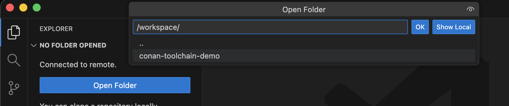

# Demo - Optimizing the Inner Loop with Conan and ZFS in Remote DevContainers

<!-- markdownlint-disable MD046 -->
<!-- markdownlint-disable MD034 -->

## Introduction

We've demonstrated the benefits of Conan build avoidance with OpenZFS for
cloning our build cache [in our previous demo](ConanZFSDemo.md).  Now how
do we extend that benefit to enhance our Developer Experience as well?

!!! quote inline end ""

    

The answer is remote
[DevContainers](https://code.visualstudio.com/docs/devcontainers/containers)
hosted in Kubernetes!

In addition to build performance and storage optimization, remote
DevContainers will also help secure endpoints by keeping our source code
and builds hosted in our datacenter!

We'll get the benefit of being able to set up our runtime environment
more similar to how we deploy production too.  Using the same container
images that our CI workflows use, with all of the same dependencies
deployed in the same manner.

"Works on my machine" is really starting to mean something now!

!!! quote annotate ""

    

    *Thanks to [Excalidraw](https://excalidraw.com/) for their nifty diagramming tool.*

### Inspiration

This was originally inspired by an article from vxlabs where they set up
Kubernetes on their development machine in order to gain remote access to
their shared VS Code development environment.

!!! abstract annotate "vxlabs - Using Kubernetes for development containers"

    Dr. Charl P. Botha (2021). "Using Kubernetes for development containers"

    vxlabs / visual x laboratories
    
    

    More: https://vxlabs.com/2021/11/21/using-kubernetes-for-development-containers

It turns out that VS Code can do most of the work once we have a container
Pod deployed in Kubernetes and the required VS Code plugins installed.

We're going to take this a bit further here and assume ***all*** access is
remote for an Enterprise-ready implementation.  We'll leverage our
centralized Kubernetes cluster for all development in order to leverage our
centrally managed, scalable ZFS storage there as well.

### Related Tools

There are a few free/open-source and commercial/SaaS tool offerings in this
space, some of which provide significant value over the solution we're
presenting here.

- [Coder](https://coder.com/) / [Envbuilder](https://github.com/coder/envbuilder/blob/main/README.md)
- [DevPod](https://devpod.sh/)
- [GitHub Codespaces](https://docs.github.com/en/codespaces)
- [Gitpod vs. Codespaces vs. Coder vs. DevPod: 2024 Comparison](https://www.loft.sh/blog/comparing-coder-vs-codespaces-vs-gitpod-vs-devpod)

None of these other tools directly address the use case we're showing here;
leveraging our copy-on-write filesystem to rapidly clone a large
build cache.  So that part is what we'll focus on in this demo.

We'll set up and detail the configuration for the plumbing required to
utilize DevContainer technology in bare-bones form, connecting it to
our ZFS Conan Cache clones.  We want our developers to benefit from our
ZFS-optimized builds just as much as our CI workflows do!

By standardizing on OpenEBS for our backend storage management, it should
be pretty straightforward to leverage ZFS in those 3rdParty solutions as
well.

## Environment

### Hardware

We'll be using the same lan and hardware setup as our other demo.

- Server - 8945HS/64GB/SSD
- Workstation - 9900X/32GB/SSD
- Notebook - Macbook Pro M4 Pro
- Network - Ubiquiti UniFi 2.5Gb/s Switch

### Software

- [Visual Studio Code](https://code.visualstudio.com/)
    - [DevContainer Extension](https://marketplace.visualstudio.com/items?itemName=ms-vscode-remote.remote-containers)
    - [Kubernetes Extension](https://marketplace.visualstudio.com/items?itemName=ms-kubernetes-tools.vscode-kubernetes-tools)
- [OpenZFS](https://openzfs.org/) filesystem and storage platform
- [OpenEBS](https://openebs.io/) with [Local PV ZFS plugin](https://github.com/openebs/zfs-localpv/blob/develop/README.md)
- [Conan C/C++ Package Manager](https://conan.io/)
- Docker - [ConanToolchain Docker Container Image](https://github.com/DaverSomethingSomethingOrg/conan-toolchain-demo/tree/main/demos/gcc-toolchain/conan-build-container/README.md)

## OpenEBS ZFS Setup

### Installing OpenEBS

Reference: [OpenEBS Installation](https://openebs.io/docs/quickstart-guide/installation)

```bash
❯ helm repo add openebs https://openebs.github.io/openebs
❯ helm repo update
```

```bash hl_lines="4"
❯ helm install openebs \
  --namespace openebs openebs/openebs \
  --set engines.replicated.mayastor.enabled=false \
  --set zfs-localpv.zfsNode.kubeletDir=/var/lib/kubelet \
  --create-namespace

NAME: openebs
LAST DEPLOYED: Wed Oct 15 08:23:30 2025
NAMESPACE: openebs
STATUS: deployed
REVISION: 1
TEST SUITE: None
NOTES:
Successfully installed OpenEBS.

Check the status by running: kubectl get pods -n openebs

The default values will install both Local PV and Replicated PV. However,
the Replicated PV will require additional configuration to be fuctional.
The Local PV offers non-replicated local storage using 3 different storage
backends i.e Hostpath, LVM and ZFS, while the Replicated PV provides one replicated highly-available
storage backend i.e Mayastor.

For more information,
- view the online documentation at https://openebs.io/docs
- connect with an active community on our Kubernetes slack channel.
        - Sign up to Kubernetes slack: https://slack.k8s.io
        - #openebs channel: https://kubernetes.slack.com/messages/openebs
❯
```

### OpenEBS StorageClass definitions

Now that OpenEBS is installed with Local PV ZFS, we'll create our PV and
snapshot StorageClass definitions.  We'll need to give the PV StorageClass
the name of our toplevel ZFS pool/dataset, and it's a good idea to specify
our worker node in here as well as these are Local PVs.

Reference: [OpenEBS Local PV ZFS - Create StorageClass(s)](https://openebs.io/docs/user-guides/local-storage-user-guide/local-pv-zfs/configuration/zfs-create-storageclass)

```yaml title="OpenEBS StorageClass definitions" hl_lines="11 17"
apiVersion: storage.k8s.io/v1
kind: StorageClass
metadata:
  name: openebs-zfspv
allowVolumeExpansion: true
parameters:
  recordsize: "128k"
  compression: "off"
  dedup: "off"
  fstype: "zfs"
  poolname: "zpool-conancache"
provisioner: zfs.csi.openebs.io
allowedTopologies:
- matchLabelExpressions:
  - key: kubernetes.io/hostname
    values:
      - hephaestus.homelab

---

kind: VolumeSnapshotClass
apiVersion: snapshot.storage.k8s.io/v1
metadata:
  name: openebs-zfspv-snapshot
  annotations:
    snapshot.storage.kubernetes.io/is-default-class: "true"
driver: zfs.csi.openebs.io
deletionPolicy: Retain
```

### Initial Parent/Toplevel DataSet

We're using the same `zpool-conancache` ZFS pool from our previous demo,
but we want to create a new toplevel dataset to clone from for our Runners
and DevContainers.  Just to isolate our Kubernetes operations from our
raw ZFS operations in our other demo.

Reference: [OpenEBS Local PV ZFS - Create PersistentVolumeClaim](https://openebs.io/docs/user-guides/local-storage-user-guide/local-pv-zfs/configuration/zfs-create-pvc)

```yaml title="gcc12-toolchain-main_dataset.yaml"
# Initial PVC for gcc12-toolchain main branch dataset
kind: PersistentVolumeClaim
apiVersion: v1
metadata:
  name: gcc12-toolchain-main
spec:
  storageClassName: openebs-zfspv
  accessModes:
    - ReadWriteOnce
  resources:
    requests:
      storage: 200Gi
```

### Kubernetes Namespace

When creating ZFS PV/PVCs, they all need to exist in the same namespace
and all need to request the same size storage resource, or things will
mysteriously not work at all.

For this demo we'll create a `devcontainer` namespace
[like vxlabs](https://vxlabs.com/2021/11/21/using-kubernetes-for-development-containers/#create-and-set-namespace).

```bash
❯ kubectl apply -f gcc12-toolchain-main_dataset.yaml --namespace devcontainer
persistentvolumeclaim/gcc12-toolchain-main created
❯ kubectl get pvc -n devcontainer
NAME                                           STATUS   VOLUME                                     CAPACITY   ACCESS MODES   STORAGECLASS    VOLUMEATTRIBUTESCLASS   AGE
gcc12-toolchain-main                           Bound    pvc-4f9dd102-cf04-44a2-845f-733d77138a6c   200Gi      RWO            openebs-zfspv   <unset>                 13d
❯
```

## DevContainer Pod

With OpenEBS set up, and ZFS ready to go, we're ready to deploy our
DevContainer!  We'll create a Pod and attach a PersistentVolumeClaim
for our Conan Cache.

Within the Pod we'll run an initContainer in order to clone our git repo
into a volume that gets attached to our devContainer once the clone is
ready.

In order to avoid file permission issues we'll want to make sure we
configure the securityContext to use the same uid/gid that owns the
files in the original dataset.  Since GitHub Actions run as `root`/`0`
by default, we'll continue that here also for convenience.

!!! warning annotate

    Changing to a non-privileged user is an obvious/needed step in
    securing this solution, but will need to be applied consistently
    throughout all users of the ZFS dataset.

Reference: [OpenEBS Local PV ZFS - Clone](https://openebs.io/docs/user-guides/local-storage-user-guide/local-pv-zfs/advanced-operations/zfs-clone)

```yaml title="devContainer-pod.yaml"
apiVersion: v1
kind: Pod
metadata:
  name: devcontainer-pod
  labels:
    app: conan
    cache: gcc12-toolchain-main
spec:
  initContainers:
  - name: code-init
    image: "nexus.homelab/conan-docker-build-ubuntu:x86_64-latest"
    securityContext:
      runAsUser: 0
      runAsGroup: 0
      #fsGroup: 2000
    command: ["/bin/sh", "-c", "git clone https://github.com/DaverSomethingSomethingOrg/conan-toolchain-demo.git /workspace/conan-toolchain-demo"]
    volumeMounts:
    - mountPath: /workspace
      name: code-volume

  containers:
  - name: conan-container
    image: "nexus.homelab/conan-docker-build-ubuntu:x86_64-latest"
    imagePullPolicy: IfNotPresent
    securityContext:
      runAsUser: 0
      runAsGroup: 0
      #fsGroup: 2000
    env:
    - name: CONAN_HOME
      value: /CONAN_HOME
    workingDir: /workspace/conan-toolchain-demo
    command: ["/bin/sh", "-c", "while sleep 1000; do :; done"]
    volumeMounts:
    - mountPath: /workspace
      name: code-volume
    - mountPath: /home/vscode/.cache
      name: cache-volume
    - mountPath: /CONAN_HOME
      name: conan-home

  volumes:
  - name: code-volume
    # https://kubernetes.io/docs/concepts/storage/volumes/#emptydir
    emptyDir: {}
  - name: cache-volume
    emptyDir: {}
  - name: conan-home
    persistentVolumeClaim:
      claimName: "gcc12-toolchain-main-hephaestus-devcontainer"

---

# Clone CONAN_HOME directly from PVC (internal snapshot)
kind: PersistentVolumeClaim
apiVersion: v1
metadata:
  name: gcc12-toolchain-main-hephaestus-devcontainer
spec:
  storageClassName: openebs-zfspv
  dataSource:
    name: gcc12-toolchain-main
    kind: PersistentVolumeClaim
  accessModes:
    - ReadWriteOnce
  resources:
    requests:
      storage: 200Gi
```

## Using the DevContainer

### Provisioning

```bash
❯ kubectl apply -f devContainer-pod.yaml --namespace devcontainer
persistentvolumeclaim/gcc12-toolchain-main created
❯ kubectl get pvc --namespace devcontainer --type all
NAME                                           STATUS   VOLUME                                     CAPACITY   ACCESS MODES   STORAGECLASS    VOLUMEATTRIBUTESCLASS   AGE
gcc12-toolchain-main                           Bound    pvc-4f9dd102-cf04-44a2-845f-733d77138a6c   200Gi      RWO            openebs-zfspv   <unset>                 13d
gcc12-toolchain-main-hephaestus-devcontainer   Bound    pvc-005c989b-75e4-485f-9a19-59877deaa3af   200Gi      RWO            openebs-zfspv   <unset>                 11d
❯
```

We can verify the snapshot/clone linkage in ZFS.  The naming is chosen
by OpenEBS internally.

```bash
❯ zfs list -t all |grep '\(pvc-4f9dd102\|pvc-005c989b\)'
zpool-conancache/pvc-4f9dd102-cf04-44a2-845f-733d77138a6c                                           20.6G   161G  20.6G  legacy
zpool-conancache/pvc-4f9dd102-cf04-44a2-845f-733d77138a6c@pvc-005c989b-75e4-485f-9a19-59877deaa3af     0B      -  20.6G  -
zpool-conancache/pvc-005c989b-75e4-485f-9a19-59877deaa3af                                            496K   161G  20.5G  legacy
❯
```

### Connecting VS Code

The Pod is running, source repo cloned, and cache volume cloned.  We're
ready to connect our VS Code instance and get to productive!

- [VS Code Documentation: Attach to a container in a Kubernetes cluster](https://code.visualstudio.com/docs/devcontainers/attach-container#_attach-to-a-container-in-a-kubernetes-cluster)


Once attached, chose "Open Folder" and navigate to the `/workspace/repoName`
directory where we mounted our `code-volume`.



**DONE!**


## Benefits

### No waiting for source clone or initial build

Remote-managing our developer sandboxes means we can keep a few spare
devcontainer pods waiting in a warm-standby pool.

When a developer needs a new workspace, we'll just assign one of our
standby devcontainer pods to them, switch to their desired branch, and
they're to the races.

### No downloading source code to endpoints

We already take steps to prevent developers from downloading our
company's intellectual property onto their notebook.  Let's make that
a positive aspect of their experience rather than a source of friction
to getting their job done!

Not only does this solution avoid having our code ending up on a stolen
or compromised endpoint, developers won't even want to wait for it to
download!

### Remote development with optimal text input latency and response time

Remote desktop display and VDI options have always been a sub-optimal
developer experience due to high latency in textual input due to
transmitting the full graphical environment.  This solution keeps the
graphics local and just the text input and output are transmitted while
editing code.

## Demo Limitations

We've taken some shortcuts in setting up this demo.  Here are some of the
areas we'd definitely want to tackle before implementhing this solution
in a production engineering environment.

### Provisioning is not fully optimized

In order to eek out every bit of performance from a remote DevContainer,
we'd want to install [`vscode-server`](https://code.visualstudio.com/docs/remote/vscode-server)
using our initContainer and have it running and waiting for remote
connection prior to the developer attaching to it.

For this demo we rely on VS Code doing the legwork of finalizing the
DevContainer setup for us, including downloading and installing
`vscode-server` and Node.js automatically.  This can be very slow if done
over a low-bandwidth remote connection.  *(I've done this from a coffee
shop and it's not an enjoyable developer experience!)*

### Custom Certificate Authority

The container image we use in our DevContainer is already configured with
our custom internal Certificate Authority (CA).  GitHub Actions Runner
Controller (ARC) provides custom certificates through a Vault or ConfigMap
mounted into the Runner containers.  Ideally we would do the same for
DevContainers for consistency and to avoid needing a customized container
base image.

### Security and Resource Quotas

Yeah, we didn't bother with any of that for this demo, but our GitHub ARC
solution (coming up in our next demo!) handles these issues from the CI
point of view.

## Conclusion

Modern technologies like Kubernetes and DevContainers bring a lot to the
table for bringing the full power of scalable high-performance
infrastructure right to the developer's desktop environment without
having to sacrifice on developer experience.

In this demo we showed how to leverage our ZFS snapshot and clone
functionality for Conan build optimization in the developer's sandbox.

Many engineering organizations are already using NetApp storage and
Kubernetes.  With some creativity and a few config files and integration
scripts we can extract far more value out of the infrastructure we
already have.  Making our developers significantly happier in the process.

## What's Next

For our next demo we'll reimplement our raw ZFS CI solution for Conan
build performance using OpenZFS, OpenEBS, and GitHub Actions Runner
Controller (ARC).

## References

- [vxlabs - Using Kubernetes for development containers](https://vxlabs.com/2021/11/21/using-kubernetes-for-development-containers/)
- [OpenEBS Local PV ZFS - Overview](https://openebs.io/docs/user-guides/local-storage-user-guide/local-pv-zfs/zfs-overview)
- [OpenEBS Local PV ZFS - GitHub / docs](https://github.com/openebs/zfs-localpv/blob/develop/README.md)
