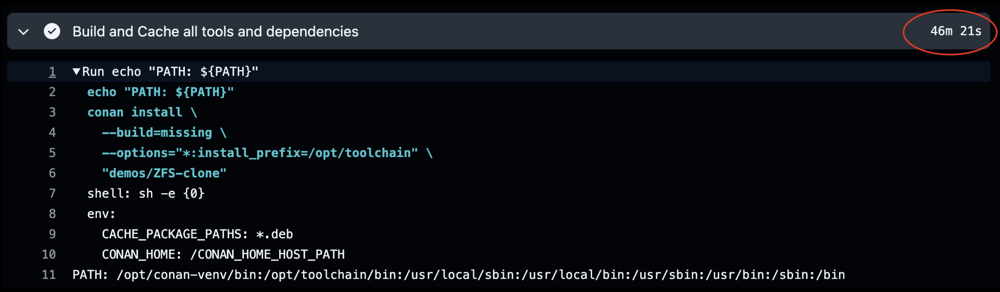
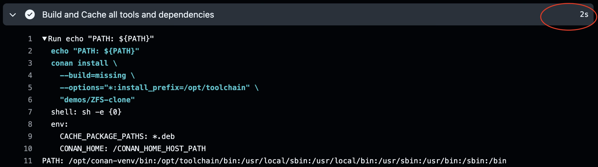

# Demo - Optimizing C/C++ Build Performance using Conan and OpenZFS

<!-- markdownlint-disable MD046 -->
<!-- markdownlint-disable MD034 -->

## Introduction

In this demo we'll show how to use Conan for build-avoidance along with
OpenZFS for build-caching.  This solution can provide the highest level of
build optimization for very, very large C/C++ projects.  Multi-million LoC
and the like.

We'll use Conan for build avoidance with pre-built binary packages and
local caching with artifact management as our backing store.  We'll employ
OpenZFS to snapshot and clone our Conan Cache to minimize time to
seed the cache for future builds. OpenZFS will also optimize storage
utilization across multiple build workspaces, such as massively-parallel
CI builds.

### A Question of Scale

For smaller projects this solution probably carries a prohibitive amount
of storage maintenance.  This solution shines in environments where
artifact management service is not local to the build servers, or
where downloading 50GB or 500GB worth of build artifacts is not practical
for every CI build or developer workspace.

With this solution we are able to optimize our utilization of CPU, storage
space, and network bandwidth all in one shot.  Not only are we saving the
time to drag package artifacts across our network, we're also saving
duplicated storage on the build side when the same package versions are
used across multiple SCM workspaces and branches.

When we're supporting multiple compiler configurations (such as optimized,
debug, coverage, and the various sanitizer options) across multiple
branches, the storage space required for very large projects can be quite
significant.

The cost of this solution is in storage architecture.  In order to maximize
the value we'll need to design our storage infrastructure specifically
around this solution.  We'll either need to centralize all CI and developer
workspaces onto the same storage cluster, or set aside local storage on
each build host specifically for build cache use.  Or some structured
compromise in between..

Sharing this cache across multiple users is certainly practical and can be
very effective with this solution.  It brings its own complications such
such as file ownership however.  Supporting multiple users is beyond
the scope of this demo.

## Conan

[Conan](https://conan.io/), the C/C++ Package Manager provides us with the
most sophisticated build caching technology available, with features such as:

- Component package versioning.
- Binary package support using hashed platform and compiler configurations.
- Local package cache that allows packages to be shared across multiple
  CI or developer workspaces (with limitations!).
- Native artifact management support in both
  [JFrog Artifactory](https://jfrog.com/help/r/jfrog-artifactory-documentation/supported-package-types)
  and [Sonatype Nexus](https://help.sonatype.com/en/formats.htm), with
  GitLab support [in-progress](https://gitlab.com/groups/gitlab-org/-/epics/8258#note_2726326123).
- Build system agnostic, with many integrations including CMake, Bazel,
  GNU Autotools/Make, and [many more](https://docs.conan.io/2/integrations.html).

With these features Conan provides a very strong build-avoidance solution
at a component level, not just individual objects/targets.  With the build
system integration, object build-avoidance technologies can still be
integrated as well. That's beyond the scope of this demo however.

Using versioned packages still leaves a lot of room for optimization.
Downloading pre-built binary packages requires significant network I/O,
and only partially helps manage storage use in supporting multiple
developer or CI workspaces.  One fundamental limitation of Conan's package
cache is that [it does not support concurrency](https://github.com/conan-io/conan/issues/15840).
Given enough developer workspaces or CI builds trying to share a local
Conan cache, we *will* run into race conditions eventually, resulting
in a corrupted cache.

## OpenZFS

[OpenZFS](https://openzfs.org/wiki/Main_Page) or other copy-on-write
filesystems that support clone functionality provide a reliable, high
performance solution to these Conan limitations.  Use of filesystem clones
allows multiple CI jobs to operate concurrently with safety.  Each
parallel runner/job can own its own clone without duplicating storage.
Further, developers may even clone from last-night's CI builds as long
as they're operating within the same filesystem (or storage cluster).

### Proven

The original inspiration for this solution comes from NetApp, where I was
part of their SCM team supporting ONTAP developer builds in Perforce.  For
our very large source code trees with their resulting large C/C++ builds,
we leveraged NetApp's own thin-provisioned FlexClone technology. This
enabled us to construct developer workspaces pre-seeded with the latest
nightly CI build virtually instantaneously.

NetApp and Perforce have published their Perforce implementation of this
solution:

- https://swarm.workshop.perforce.com/projects/netapp-p4flex/
- https://swarm.workshop.perforce.com/view/guest/netapp/p4flex/extras/docs/P4Flex_Overview_20160511.pdf

This solution provided a very significant developer productivity gain, in
most cases.  Developers no longer needed to do an initial ONTAP build in
their workspaces.  They could simply clone last-night's CI build workspace,
sync their client to pick up today's changes, and then perform an
incremental build from there.

Reliability was not perfect however, and broken builds could result in
the developer having to do a clean full build to get back on track.

Conan improves reliability and error-recovery significantly.  If the Conan
cache is corrupted somehow, rebuilding the cache is as simple as creating
a new cache clone.  Or worst-case, re-populate the cache from artifact
management.  Incremental builds become incremental downloads instead.
Additionally, Conan separates the cache storage from the developer
workspace.  The impact of any cache issue is isolated from the SCM
workspace, and vice-versa.

## Environment and Initial Setup

### Hardware

- Server - 8945HS/64GB/SSD
- Workstation - 9900X/32GB/SSD
- Notebook - Macbook Pro M4 Pro
- Network - Ubiquiti UniFi 2.5Gb/s Switch

### Software

- [Sonatype Nexus Community Edition](https://www.sonatype.com/products/nexus-community-edition-download)
- [OpenZFS](https://openzfs.org/) filesystem and storage platform
- [Conan C/C++ Package Manager](https://conan.io/)
- Docker - [ConanToolchain Docker Container Image](https://github.com/DaverSomethingSomethingOrg/conan-toolchain-demo/tree/main/demos/gcc-toolchain/conan-build-container/README.md)
- [GitHub Actions](https://github.com/features/actions) with a self-hosted Runner

### OpenZFS Setup

For this example, we've got 200GB of storage on our NVMe drive unallocated,
so we'll give it to ZFS and set up a pool to use it.  We don't care about
tracking file access time in our Conan cache, so we want to make sure we turn
that off to improve performance.

```bash title="Creating the ZFS Pool"
zpool create zpool-conancache /dev/nvme0n1p7
zfs set atime=off zpool-conancache
```

In order to delegate management of this pool for this demo, we'll simply
grant `sudo` access for our CI user `github-runner` to run `/usr/sbin/zfs`.

```text title="/etc/sudoers entry"
github-runner    ALL=NOPASSWD: /usr/sbin/zfs
```

!!! warning annotate

    Sudo is absolutely not a recommended solution for production use, but
    works fine for this single-user demo.  For some alternative
    suggestions, see the discussion below:
    [sudo vs. zfs allow vs. SSH command key](#sudo-vs-zfs-allow-vs-ssh-command-key)

### Conan Center Index

For use throughout my [ConanToolchain](index.md) project, I've been maintaining
a fork of the Conan Center Index recipe repo.

!!! github-reference annotate "[conan-center-index](https://github.com/conan-io/conan-center-index/blob/master/README.md)"

    Conan Center Index is the source index of recipes of the ConanCenter
    package repository for Conan.

    - https://github.com/conan-io/conan-center-index/blob/master/README.md

In this fork I've modified the recipes to download source bundles from GNU
mirrors rather than the primary GNU FTP site, and in some cases commit
the source bundle into the fork to avoid repeated downloads hammering
GNU's mirror sites.

### GitHub Actions Workflow

For this demo I've implemented a simple GitHub Actions Workflow
[ConanZFSDemo.yml](https://github.com/DaverSomethingSomethingOrg/conan-toolchain-demo/tree/main/.github/workflows/ConanZFSDemo.yml)
to manage ZFS, leveraging my existing reusable ConanToolchain workflow
[conan-toolchain.yml](https://github.com/DaverSomethingSomethingOrg/conan-github-workflows/blob/main/.github/workflows/conan-toolchain.yml)
to assemble a project with enough components to be interesting.  The
[Conan Center Index](https://conan.io/center) provided
all of the components used here (with some minor modifications).

The `ConanZFSDemo.yml` workflow mixes a combination of shell jobs directly
on the runner host to manipulate ZFS, and a Docker job to run the
`conan-toolchain.yml` workflow leveraging the ZFS cache.

#### Create snapshot and clone for our new build cache

The first workflow job creates a new temporary snapshot and clone for our
new build cache.

```bash
zfs snapshot "${ZFS_BUILD_SNAPSHOT}"
zfs clone "${ZFS_BUILD_SNAPSHOT}" "${ZFS_BUILD_CLONE}
```

Our snapshot naming looks like:

- `${ZPOOL_NAME}/${PROJECT}/${GITHUB_REF_NAME}@${JOB_HOST}-pre${GITHUB_RUN_ID}`

Example: `zpool-conancache/gcc12-toolchain/main@hephaestus-pre18171656687`

We give our snapshot a prefix `pre` because the snapshot is readonly, and
we don't really know when or how the original cache state was established.
We only know that this was the state prior to this build workflow.

Our clone naming represents the cache state throughout this build:

- `${ZPOOL_NAME}/${PROJECT}/${GITHUB_REF_NAME}_${JOB_HOST}-${GITHUB_RUN_ID}`

Example: `zpool-conancache/gcc12-toolchain/main_hephaestus-18171656687`

```bash title="Example ZFS status with CI snapshots and clones provisioned"
$ zfs list -r -o name,used,avail,refer
NAME                                                           USED  AVAIL  REFER
zpool-conancache                                              7.97G   183G    24K
zpool-conancache/gcc12-toolchain                              7.96G   183G    25K
zpool-conancache/gcc12-toolchain/main                         7.96G   183G  7.96G
zpool-conancache/gcc12-toolchain/main_hephaestus-18171656687     1K   183G  7.96G
$ 

$ zfs list -t snapshot -o name,used,refer
NAME                                                              USED  REFER
zpool-conancache/gcc12-toolchain/main@hephaestus-pre18171656687     0B  7.96G
$ 
```

#### Running the build

Running our build is the same as any other Conan project.  We're just
connecting a special cache directory and making sure our `CONAN_HOME`
environment is pointed at it.

For our CI workflow we reuse the [conan-toolchain.yml](https://github.com/DaverSomethingSomethingOrg/conan-github-workflows/blob/main/.github/workflows/conan-toolchain.yml)
workflow, but in a shell script it looks something like this:

```bash title="Containerized Build Startup"
DOCKER_IMAGE="nexus.homelab/conan-docker-build-ubuntu:x86_64-latest"
docker run -it --rm \
    --volume="/${BUILD_CLONE}:${CONTAINER_CONAN_HOME}" \
    --volume="${SERVER_WORKSPACE_ROOT}:${CONTAINER_WORKSPACE_ROOT}" \
    --env="CONAN_HOME=${CONTAINER_CONAN_HOME}" \
    --env="INSTALL_PREFIX=${INSTALL_PREFIX}" \
    --env="CONTAINER_WORKSPACE_ROOT=${CONTAINER_WORKSPACE_ROOT}" \
    --env="COMPONENT_SUBDIR=${CONTAINER_WORKSPACE_ROOT}/${WORKSPACE_SUBDIR}" \
    "${DOCKER_IMAGE}" \
    "${CONTAINER_WORKSPACE_ROOT}/${CONAN_BUILD_SCRIPT}"

# Detect build failures
retval=$?
```

```bash title="Conan Build Script"
conan profile detect
conan config install https://github.com/DaverSomethingSomethingOrg/conan-system-packaging.git

conan remote add -t local-recipes-index conan-local-recipes "${CONTAINER_WORKSPACE_ROOT}/conan-center-index"
conan remote update conan-local-recipes --index 0

conan remote add conan-local-repo https://nexus.homelab/repository/conan-homelab
conan remote update conan-local-repo --index 0

conan install --build=missing \
              --options="*:install_prefix=${INSTALL_PREFIX}" \
              "${COMPONENT_SUBDIR}"
```

#### Promote the Successful Build's clone

In order to make sure we don't lose data, we'll follow the typical process
of renaming the old dataset clone in-place before renaming the new clone
to the old name.  Only then can we destroy the original (now legacy) clone
and snapshot.

```bash
zfs promote "${ZFS_BUILD_CLONE}"
zfs rename "${ZFS_BRANCH_DATASET}" "${ZFS_BRANCH_DATASET}-legacy"
zfs rename "${ZFS_BUILD_CLONE}" "${ZFS_BRANCH_DATASET}"
zfs destroy "${ZFS_BRANCH_DATASET}-legacy"
zfs destroy "${ZFS_BUILD_SNAPSHOT}
```

#### Save or Destroy a Failed Build's clone

If our build is configured to save failed builds, we simply do nothing. We
can leave the new snapshot and clone created for our build just as they
are, and this ensures all access paths remain the same for troubleshooting
as well.

Future builds will snapshot/clone against the original branch dataset just
as our current build did.

```bash
zfs destroy "${ZFS_BUILD_CLONE}"
zfs destroy "${ZFS_BUILD_SNAPSHOT}
```

#### Updated cache state

Following a promoted successful build or destroyed failed build, our cache
state returns to its initial ready state for the branch.  No snapshots, and
only a dataset representing a the latest good cache for the branch we're
working on.

```bash title="Example ZFS status with CI snapshots and clones provisioned"
$ zfs list -r -o name,used,avail,refer
NAME                                                           USED  AVAIL  REFER
zpool-conancache                       8.62G   182G    24K
zpool-conancache/gcc12-toolchain       8.61G   182G    25K
zpool-conancache/gcc12-toolchain/main  8.61G   182G  8.61G
$ 

$ zfs list -t snapshot -o name,used,refer
no datasets available
$ 
```

## Performance comparisons

As mentioned previously, my test environment is hardly representative of
real-world scenarios this solution would be used for.  Showing these
results at least helps frame the amount of computation and resource
utilization for each type of operation.

!!! note annotate "Empty cache, clean build without Artifact Management available"

    

!!! note annotate "Empty cache, clean build with full download from Artifact Management"

    

!!! note annotate "Fully seeded cache, clean build"

    

### Snapshot and Clone Provisioning Overhead

To be completely fair, we do need to factor in the time it takes to create
the ZFS snapshot and clone for our 8.61GB dataset.

!!! note annotate "Snapshot and Clone Provisioning time"

    

Since it's is hard to get a precise timing on this operation in CI,
here's the same operation from our interactive shell:

```bash hl_lines="5-6"
❯ time zfs snapshot zpool-conancache/gcc12-toolchain/main@hephaestus-pre18171656687; \
  time zfs clone zpool-conancache/gcc12-toolchain/main@hephaestus-pre18171656687 \
                 zpool-conancache/gcc12-toolchain/main_hephaestus-18171656687

zfs snapshot   0.00s user 0.01s system 37% cpu 0.021 total
zfs clone      0.00s user 0.00s system 21% cpu 0.027 total
❯
```

!!! info annotate "Special Note"

    An important consideration here is that both "clean build" and
    "full download" timings will scale linearly with the size of
    the project.

    ZFS snapshot/clone timing **should be constant**, depending more
    on the storage speed and kernel load instead of project size.

## Limitations and Issues

### Linking and Deployment performance is not optimized

While this represents the ultimate compile-avoidance solution, other
phases of the "build" remain unaffected.  If our application is
statically linked, bundled into an "image", or even repackaged for
deployment, we'll need to optimize those steps separately.

Conan itself does support "vendoring" of dependencies, and this could
be very useful in building "sub-assemblies" or "subsystem" component
packages.  This is very effective when development is highly focused on
a few specific components in our product.  The rest of the components
may be packaged together (such as archiving static libraries together)
to simplify the dependency graph and reduce random-access I/O at
linking time.

- https://docs.conan.io/2/devops/vendoring.html

Optimizing the full deployment process for our application will be
very specific to the system architecture and infrastructure.

### `sudo` vs. `zfs allow` vs. SSH command key

For the sake of expediency in this demo we used `sudo` to enable our
automation user to manipulate ZFS snapshots and clones.  In the real world,
with multiple users and different use cases we would want a solution with
stronger security.

The `zfs allow` command looks like it should enable this functionality,
but on Linux the `mount` (and `zfs mount`) cannot be delegated so easily
for our use case.  We can delegate creation of our dataset snapshots and
clones directly, but if we cannot mount/umount them, we can't use them!

- [Possible Workarounds for Inability to Mount as non-root under Linux](https://github.com/openzfs/zfs/discussions/10648)

An approach I'd recommended would be to call `zfs` from behind an SSH
command key.  With SSH we can implement a server-side script run by a
special automation user account.  We would only need to grant that one
account delegated ZFS permissions, and the script could validate the
authorization for the command being run against our rules for maintaining
the filesystem.

Rob Napier at Cisco wrote this excellent and concise whitepaper on
implementing such solutions for the USENIX LISA Conference.  It's worth a
read!

- [Secure Automation: Achieving Least Privilege with SSH, Sudo and Setuid](https://www.usenix.org/legacy/publications/library/proceedings/lisa04/tech/napier.html)

## What's Next

For our next demo we'll implement a similar solution for use in our
Kubernetes cluster. Kubernetes brings some significant benefits for
security and delegated storage management, but also introduces some new
limitations and challenges to overcome.

Check it out [here](ConanK8sDevContainerDemo.md).
