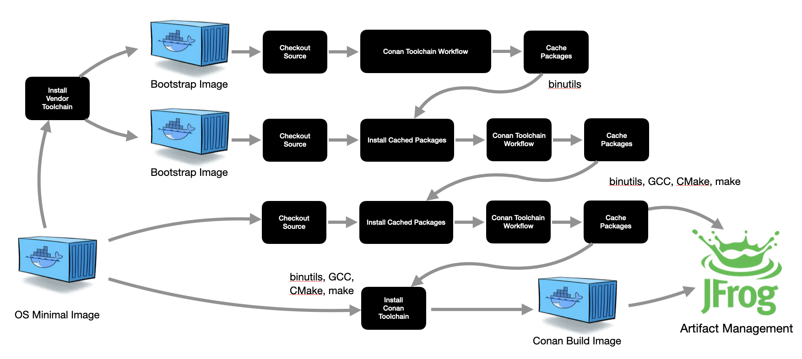

# Demo - MultiPhase Toolchain Build

We use our tools to build our tools.  But we need to get started
on a new platform by building our basic compiler suite.

Using caching in GitHub Actions, we can connect multiple toolchain
workflows to each other. Dependencies built in one phase
will be pre-installed for use in subsequent phases.

Workflow Structure:

<pre id="workflow-tree">
<a href="https://github.com/DaverSomethingSomethingOrg/conan-github-workflows/blob/main/.github/workflows/conan-demoToolchain.yml">conan-demoToolchain.yml</a></br>
  ├── phase 1 - <a href="https://github.com/DaverSomethingSomethingOrg/conan-github-workflows/blob/main/.github/workflows/conan-multiPlatformToolchain.yml">conan-multiPlatformToolchain.yml</a></br>
  │     ├── ubuntu-aarch64 - <a href="https://github.com/DaverSomethingSomethingOrg/conan-github-workflows/blob/main/.github/workflows/conan-toolchain.yml">conan-toolchain.yml</a></br>
  │     ├── ubuntu-x86_64 - <a href="https://github.com/DaverSomethingSomethingOrg/conan-github-workflows/blob/main/.github/workflows/conan-toolchain.yml">conan-toolchain.yml</a></br>
  │     ├── almalinux-aarch64 - <a href="https://github.com/DaverSomethingSomethingOrg/conan-github-workflows/blob/main/.github/workflows/conan-toolchain.yml">conan-toolchain.yml</a></br>
  │     └── almalinux-x86_64 - <a href="https://github.com/DaverSomethingSomethingOrg/conan-github-workflows/blob/main/.github/workflows/conan-toolchain.yml">conan-toolchain.yml</a></br>
  ├── phase 2 - <a href="https://github.com/DaverSomethingSomethingOrg/conan-github-workflows/blob/main/.github/workflows/conan-multiPlatformToolchain.yml">conan-multiPlatformToolchain.yml</a></br>
  │     ├── ubuntu-aarch64 - <a href="https://github.com/DaverSomethingSomethingOrg/conan-github-workflows/blob/main/.github/workflows/conan-toolchain.yml">conan-toolchain.yml</a></br>
  │     ├── ubuntu-x86_64 - <a href="https://github.com/DaverSomethingSomethingOrg/conan-github-workflows/blob/main/.github/workflows/conan-toolchain.yml">conan-toolchain.yml</a></br>
  │     ├── almalinux-aarch64 - <a href="https://github.com/DaverSomethingSomethingOrg/conan-github-workflows/blob/main/.github/workflows/conan-toolchain.yml">conan-toolchain.yml</a></br>
  │     └── almalinux-x86_64 - <a href="https://github.com/DaverSomethingSomethingOrg/conan-github-workflows/blob/main/.github/workflows/conan-toolchain.yml">conan-toolchain.yml</a></br>
  └── phase 3 - <a href="https://github.com/DaverSomethingSomethingOrg/conan-github-workflows/blob/main/.github/workflows/conan-multiPlatformToolchain.yml">conan-multiPlatformToolchain.yml</a></br>
        ├── ubuntu-aarch64 - <a href="https://github.com/DaverSomethingSomethingOrg/conan-github-workflows/blob/main/.github/workflows/conan-toolchain.yml">conan-toolchain.yml</a></br>
        ├── ubuntu-x86_64 - <a href="https://github.com/DaverSomethingSomethingOrg/conan-github-workflows/blob/main/.github/workflows/conan-toolchain.yml">conan-toolchain.yml</a></br>
        ├── almalinux-aarch64 - <a href="https://github.com/DaverSomethingSomethingOrg/conan-github-workflows/blob/main/.github/workflows/conan-toolchain.yml">conan-toolchain.yml</a></br>
        └── almalinux-x86_64 - <a href="https://github.com/DaverSomethingSomethingOrg/conan-github-workflows/blob/main/.github/workflows/conan-toolchain.yml">conan-toolchain.yml</a></br>
</pre>

## Phase 1 - GNU binutils

GCC depends on binutils, so that's where we start.  We need a working
compiler to build our tools though, so we'll use a special bootstrap
container image with the OS Vendor's compiler chain installed.

```python title="phase 1 - conanfile.py"
    # For this bootstrapping phase we'll depend on OS vendor-provided tools
    def system_requirements(self):
        Apt(self).install(["make", "cmake", "binutils", "gcc"])
        Yum(self).install(["make", "cmake", "binutils", "gcc"])

    def requirements(self):
        self.requires("binutils/2.42")
```
[Link to full conanfile.py](https://github.com/DaverSomethingSomethingOrg/conan-github-workflows/blob/main/components/phase1/conanfile.py)

## Phase 2 - bootstrapping CMake, GNU Make, and GCC

In Phase 2, we'll build our GCC configured to use our binutils package from
Phase 1.  We're still depending on the system GCC however, so we still want
the OS Vendor's binutils available for their GCC as well.

```python title="phase 2 - conanfile.py"
    # For this bootstrapping phase we'll depend on OS vendor-provided tools
    def system_requirements(self):
        Apt(self).install(["make", "cmake", "binutils", "gcc",
                           "opt+toolchain-binutils_2.42-0",
                          ])
        Yum(self).install(["make", "cmake", "binutils", "gcc",
                           "opt-toolchain-binutils-2.42-0",
                          ])

    def requirements(self):
        self.requires("make/4.4.1")
        self.requires("cmake/4.0.1")
        self.requires("gcc/12.2.0"
```
[Link to full conanfile.py](https://github.com/DaverSomethingSomethingOrg/conan-github-workflows/blob/main/components/phase2/conanfile.py)

## Phase 3 - Clean rebuilds using our toolchain

Finally, we will go back to our OS-minimal container image, install the
tools we built in the previous phases, and rebuild all of our tools.

By using the OS-minimal image this time, we can be certain that there
will be no surprise dependencies on the original OS Vendor toolchain.

We only upload these final builds to Artifact Management, along with a brand
new Conan Build container image for building all other tools we support.
The previous packages built with our bootstrap image are discarded.

```python title="phase 3 - conanfile.py"
    # Finally, we use our tools from phase 1 and 2 to build our tools again
    def system_requirements(self):
        Apt(self).install(["opt+toolchain-make-4.4.1-0",
                           "opt+toolchain-cmake-4.0.1-0",
                           "opt+toolchain-gcc-12.2.0-0",
                           "opt+toolchain-binutils_2.42-0",
                          ])
        Yum(self).install(["opt-toolchain-make-4.4.1-0",
                           "opt-toolchain-cmake-4.0.1-0",
                           "opt-toolchain-gcc-12.2.0-0",
                           "opt-toolchain-binutils-2.42-0",
                          ])

    def requirements(self):
        self.requires("make/4.4.1")
        self.requires("cmake/4.0.1")
        self.requires("binutils/2.42")
        self.requires("gcc/12.2.0"
```
[Link to full conanfile.py](https://github.com/DaverSomethingSomethingOrg/conan-github-workflows/blob/main/components/phase3/conanfile.py)

!!! note annotate "For each platform, we end up with an overall flow that looks like this"

    

## See Also

!!! github-reference annotate "[conan-docker-tools](https://github.com/conan-io/conan-docker-tools)"

    The Conan project builds similar images for this purpose, but with a
    few significant differences:

    - `conan-docker-tools` does a custom compiler build directly in their
      [Dockerfile](https://github.com/conan-io/conan-docker-tools/blob/master/images/gcc/Dockerfile) and does not use Conan at all.
    - We use the same Conan recipes and mechanism (Conan) to build the
      toolchain container that we provide to developers.
    - Using system packaging for our toolchain allows temporal-parallelism
      for our container builds.  Changing container configuration or
      installing updates does not necessarily require rebuilding the
      toolchain.
    - We build both Ubuntu and AlmaLinux (RedHat derived), as well as
      ARM and x86 CPU architectures.
